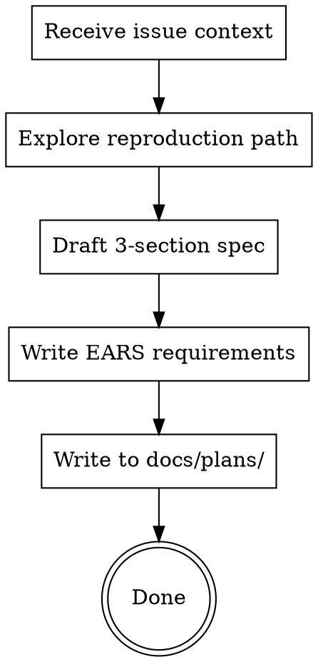

# Bugfix Spec

Produce a structured bugfix specification that captures what's broken, what correct behavior looks like, and what existing behavior must be preserved. Output: `docs/plans/YYYY-MM-DD-issue-${ISSUE_NUMBER}-design.md`. This skill is dispatched by `coder-task` when it classifies an issue as a bug — it is not a standalone entry point.

## Process



## Inputs

This skill receives context from `coder-task`:
- Issue description (title, body, comments)
- Reproduction steps (from the issue or discovered during exploration)
- Codebase exploration results (affected files, error paths, existing tests)

## Bugfix Spec Template

Three sections. Intentionally simpler than a full design doc — bugfixes are behavioral deltas, not system design exercises.

### 1. Current Behavior (What's Wrong)

Describe the observed defect using EARS format for precision:

```
WHEN [trigger condition] THE SYSTEM [incorrect behavior observed]
```

Include:
- **Steps to reproduce** — exact sequence to trigger the bug
- **Actual output** — error messages, incorrect values, stack traces
- **Affected code paths** — file:line references to where the bug manifests
- **Environment** — if the bug is environment-specific, note the conditions

### 2. Expected Behavior (What Should Happen)

EARS requirements for the correct behavior. Each must be testable and unambiguous.

```
WHEN [same trigger condition] THE SYSTEM SHALL [correct behavior]
```

These become the **fix tests** — they must fail before the fix and pass after.

### 3. Unchanged Behavior (What Must Not Break)

EARS requirements for existing behaviors that must continue working after the fix. Use the `SHALL CONTINUE TO` pattern:

```
THE SYSTEM SHALL CONTINUE TO [existing behavior that works correctly]
```

For each preserved behavior, cite a **verification anchor** — an existing test that covers it:

```
Verification anchor: tests/path/to/existing.test.ts
```

These become the **preservation tests** — they must pass both before and after the fix.

If you are uncertain which existing behaviors to protect, explore the test suite in the impact area before proceeding. When in doubt, list more preserved behaviors rather than fewer.

## Fix Property / Preservation Property

The bugfix spec implicitly defines two categories of tests, formalized by the "Bug Fix Paradox":

- **Fix Property** (from Expected Behavior): when the bug condition holds, the patched code produces the correct result. These tests fail before the fix and pass after.
- **Preservation Property** (from Unchanged Behavior): when the bug condition does NOT hold, behavior is identical to before the fix. These tests pass both before and after.

When this spec is decomposed into tasks, the task list must include both categories explicitly. The first task is always a reproduction test demonstrating the Fix Property fails (proving the bug exists).

## Clarification Markers

During drafting, if you make assumptions about the bug's scope, trigger conditions, or expected behavior, mark them:

```
[NEEDS CLARIFICATION: <specific question> — assumed: <your best guess>]
```

Maximum 3 markers. In autonomous mode (`coder-task`), these are posted to the GitHub issue and execution proceeds with the assumed answers.

## Sections Intentionally Omitted

This template does not include Goals/Non-Goals, System Design, or Libraries sections from the full `writing-specs` format. Bugfixes are behavioral deltas — the system design already exists and is not changing. If a bug requires architectural changes, it should be handled as a feature via `writing-specs` instead.

## Scaling

Most bugfixes produce a short spec (3-5 EARS requirements total). If the spec grows beyond 10 requirements, consider whether this is really a feature request in disguise.

## Common Mistakes

| Mistake | Fix |
|---------|-----|
| No reproduction test | First task must always be a test proving the bug exists |
| Fixing without understanding root cause | Trace the bug's code path before writing Expected Behavior |
| Missing preservation tests | List existing behaviors in the impact area and cite verification anchors |
| Scope creep beyond the bug | Bugfix specs fix one bug — additional improvements belong in a separate spec |
| Empty Unchanged Behavior section | If you can't identify preserved behaviors, you haven't explored the impact area enough |

---

## Examples

See `skills/writing-specs/examples/` for bugfix and brownfield examples:
- `bugfix-small-regression.md` — Rate limiter over-counting after a library upgrade
- `brownfield-delta-change.md` — Adding retry logic to an existing webhook system
