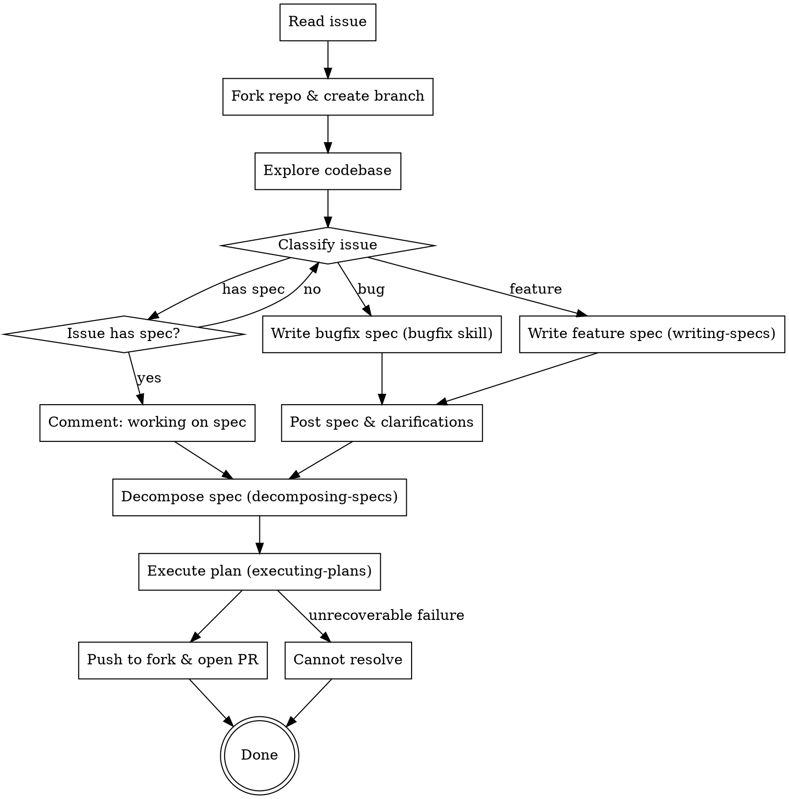

# Flow: code-factory-issue

State machine for the scripted issue → spec → plan → PR pipeline. Read this for orientation; rules live in `SKILL.md`.

```dot
digraph code_factory {
    "Read issue" [shape=box];
    "Fork repo & create branch" [shape=box];
    "Explore codebase" [shape=box];
    "Classify issue" [shape=diamond];
    "Issue has spec?" [shape=diamond];
    "Write bugfix spec (bugfix skill)" [shape=box];
    "Write feature spec (writing-specs)" [shape=box];
    "Comment: working on spec" [shape=box];
    "Post spec & clarifications" [shape=box];
    "Decompose spec (decomposing-specs)" [shape=box];
    "Execute plan (executing-plans)" [shape=box];
    "Push to fork & open PR" [shape=box];
    "Done" [shape=doublecircle];
    "Cannot resolve" [shape=box];

    "Read issue" -> "Fork repo & create branch";
    "Fork repo & create branch" -> "Explore codebase";
    "Explore codebase" -> "Classify issue";
    "Classify issue" -> "Issue has spec?" [label="has spec"];
    "Classify issue" -> "Write bugfix spec (bugfix skill)" [label="bug"];
    "Classify issue" -> "Write feature spec (writing-specs)" [label="feature"];
    "Issue has spec?" -> "Comment: working on spec" [label="yes"];
    "Issue has spec?" -> "Classify issue" [label="no"];
    "Write bugfix spec (bugfix skill)" -> "Post spec & clarifications";
    "Write feature spec (writing-specs)" -> "Post spec & clarifications";
    "Comment: working on spec" -> "Decompose spec (decomposing-specs)";
    "Post spec & clarifications" -> "Decompose spec (decomposing-specs)";
    "Decompose spec (decomposing-specs)" -> "Execute plan (executing-plans)";
    "Execute plan (executing-plans)" -> "Push to fork & open PR";
    "Push to fork & open PR" -> "Done";
    "Execute plan (executing-plans)" -> "Cannot resolve" [label="unrecoverable failure"];
    "Cannot resolve" -> "Done";
}
```
