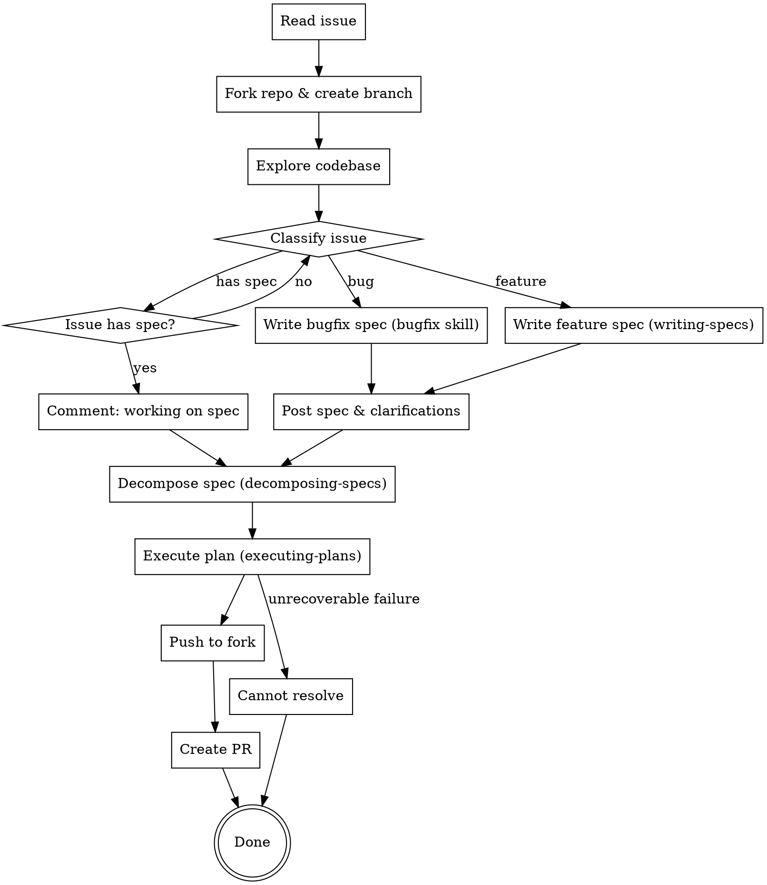

# Coder Task

Autonomous end-to-end workflow: GitHub issue → spec → multi-file plan → implementation → PR on a fork.

## Inputs

The following must be provided or derived from the issue URL:

- `ISSUE_URL` — full GitHub issue URL
- `REPO_URL` — repository URL
- `REPO_OWNER` — upstream repo owner
- `REPO_NAME` — upstream repo name
- `ISSUE_NUMBER` — issue number

## Process



## Step 1: Read the Issue

```bash
gh issue view ${ISSUE_URL} --json title,body,comments
```

Extract: problem description, reproduction steps, acceptance criteria, any existing spec content, and user comments that add context.

## Step 2: Fork & Branch

```bash
gh repo fork ${REPO_URL} --clone=false
git remote add fork https://github.com/$(gh api user --jq .login)/${REPO_NAME}.git
git checkout -b fix/issue-${ISSUE_NUMBER}
```

Skip the fork if one already exists. Skip adding the remote if it's already configured.

## Step 3: Light Codebase Exploration (for classification + spec writing only)

Dispatch one or two `Explore` subagents to confirm what's needed for **classifying the issue** and **writing the spec** — nothing more. The `decomposer` agent in Step 6 will do its own deep codebase exploration in its own context; replicating it here just bloats the main context.

Scope:
- Files mentioned in the issue and their immediate vicinity (for bug reports: error paths and related tests)
- High-level project shape (language, framework, where the affected subsystem lives)
- Whether the issue's described behavior actually exists in the current code (for bugs)

Do NOT explore:
- Pattern files for new code (the decomposer handles this)
- Reusable helpers / utilities catalog (the decomposer handles this)
- CI command discovery (the decomposer handles this and writes it to `standards.md`)

## Step 4: Classify Issue

After exploring the codebase, determine whether this issue describes a **bug** or a **feature** by analyzing the issue content.

**Indicators of a bug:**
- Describes broken or incorrect behavior ("X is happening when it shouldn't", "expected Y but got Z")
- References a regression ("this used to work", "broke after update/deploy")
- Includes error messages, stack traces, or unexpected output
- Describes a deviation from documented or previously working behavior

**Indicators of a feature:**
- Describes new capability ("add support for X", "implement Y")
- Requests behavioral change that never existed
- Proposes new API surface, configuration, or integration

Do NOT rely on issue labels — read the issue body and comments to make this determination.

First, check whether the issue body already contains a spec matching the `writing-specs` format (EARS requirements, system design, testing & validation sections). If so, post a short comment and use it directly:

```bash
gh issue comment ${ISSUE_URL} --body "Working on implementing the spec from this issue."
```

## Step 5: Write Spec

**If the issue is a bug:** Use the `bugfix` skill to produce a 3-section spec (Current Behavior / Expected Behavior / Unchanged Behavior). Write it to `docs/plans/YYYY-MM-DD-issue-${ISSUE_NUMBER}-design.md`.

**If the issue is a feature:** Write a spec using the `writing-specs` format. Write it to `docs/plans/YYYY-MM-DD-issue-${ISSUE_NUMBER}-design.md`.

In both cases, post the spec as a comment on the issue:

```bash
gh issue comment ${ISSUE_URL} --body "<spec in markdown>"
```

**Clarification markers:** If the spec contains `[NEEDS CLARIFICATION]` markers, post them as a separate issue comment listing each question and the assumed answer. Then proceed immediately — do not wait for a response.

```bash
gh issue comment ${ISSUE_URL} --body "## Open Questions

While writing the spec, I made the following assumptions. Please correct me if any are wrong:

1. [question] — I assumed [answer]
2. [question] — I assumed [answer]

I'm proceeding with these assumptions. If you respond with corrections, I'll update the spec and adjust the implementation."
```

Do not wait for user approval — proceed to decomposition. If the user later comments with corrections, handle them as described in "Receiving Comments" below.

## Step 6: Decompose

Use the `decomposing-specs` skill to break the spec into a multi-file phased task plan. Output: directory `docs/plans/YYYY-MM-DD-issue-${ISSUE_NUMBER}/` containing `plan.md`, `standards.md`, and `phases/NN-<name>.md` files (Phase 1 + Verification fully elaborated; intermediate phases as sketches that the executor elaborates just-in-time).

## Step 7: Execute

Use the `executing-plans` skill to implement the plan. Pass it the plan directory path (`docs/plans/YYYY-MM-DD-issue-${ISSUE_NUMBER}/`), not individual files. This handles:
- On-demand phase loading (only `plan.md` + `standards.md` at startup; phase files load one at a time)
- Just-in-time phase elaboration via `phase-elaborator` for sketched phases (so Phase N is fleshed out against the post-Phase-N-1 codebase)
- Batched / sequential / parallel implementer dispatch
- Size-scaled phase-boundary reviews (Tier A defer for tiny phases, Tier B focused for risky tiny phases, Tier C full suite for ≥3-task phases) with severity-gated re-review
- Final CI verification + full spec review
- Remediation + auto-debug escalation

## Step 8: Push & PR

Once execution completes and final validation passes:

```bash
git push fork fix/issue-${ISSUE_NUMBER}
```

```bash
gh pr create \
    --repo ${REPO_OWNER}/${REPO_NAME} \
    --head $(gh api user --jq .login):fix/issue-${ISSUE_NUMBER} \
    --draft \
    --title "<concise title>" \
    --body "Resolves ${ISSUE_URL}

<description of changes>"
```

The PR body must include `Resolves ${ISSUE_URL}` to link the issue.

## Failure Path

If the issue cannot be resolved after executing-plans exhausts its remediation cycles, do not create a PR. Instead, comment on the issue explaining what was attempted and where it failed:

```bash
gh issue comment ${ISSUE_URL} --body "<explanation of what was tried and why it failed>"
```

## Receiving Comments

The user may interrupt with comments adding requirements or clarifications. When this happens:

1. Update the spec (both the issue comment and the local file)
2. Re-run `decomposing-specs` — the `decomposer` rewrites `plan.md`, `standards.md`, and the phase files in place. Phases already executed stay on disk; the new plan should preserve their structure where the requirements still hold.
3. Resume `executing-plans` from the earliest affected phase. Sketched phases automatically pick up the new requirements when the `phase-elaborator` runs at their boundary — no manual rework for sketches. Don't redo work whose requirements are unchanged.

## Autonomy Rule

This workflow never blocks on human input. Three places where questions arise, all handled the same way — post to the GitHub issue and continue:

1. **Clarification markers** (from writing-specs or bugfix) → post assumptions to issue, proceed with assumed answers
2. **`NEEDS_HUMAN` verdict** (from auto-debugger during executing-plans) → post root-cause analysis to issue, treat as `BLOCK_TASK`, continue with unblocked work
3. **Unresolvable failure** (executing-plans exhausts all remediation including auto-debugger) → post explanation of what was attempted to the issue, create draft PR with partial work if any tasks completed successfully, or skip PR if nothing is shippable

In all three cases, the PR description (or issue comment if no PR) should include a **"Needs Human Input"** section listing each unresolved question or blocker with the context needed to make a decision.

## Rules

- **Always work on a fork** — you do not have push access to the upstream repo
- **Do not create a PR until final validation passes** — All verifications pass + spec compliance confirmed. Exception: create a draft PR with partial work if some tasks completed successfully but others are blocked.
- **Link the issue** — every PR must include `Resolves ${ISSUE_URL}`
- **Comment on failure** — if you can't resolve it, explain what you tried
- **Never wait for human input** — post questions to the issue and proceed with best-effort assumptions
