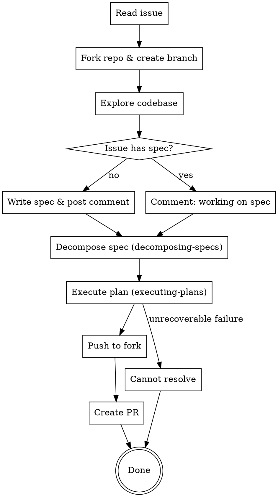

# Coder Task

Autonomous end-to-end workflow: GitHub issue → spec → task list → implementation → PR on a fork.

## Inputs

The following must be provided or derived from the issue URL:

- `ISSUE_URL` — full GitHub issue URL
- `REPO_URL` — repository URL
- `REPO_OWNER` — upstream repo owner
- `REPO_NAME` — upstream repo name
- `ISSUE_NUMBER` — issue number

## Process



## Step 1: Read the Issue

```bash
gh issue view ${ISSUE_URL} --json title,body,comments
```

Extract: problem description, reproduction steps, acceptance criteria, any existing spec content, and user comments that add context.

## Step 2: Fork & Branch

```bash
gh repo fork ${REPO_URL} --clone=false
git remote add fork https://github.com/$(gh api user --jq .login)/${REPO_NAME}.git
git checkout -b fix/issue-${ISSUE_NUMBER}
```

Skip the fork if one already exists. Skip adding the remote if it's already configured.

## Step 3: Explore the Codebase

Dispatch explore subagents to understand the parts of the codebase relevant to the issue. Focus on: files mentioned in the issue, error paths, related tests, and the project's build/test/lint commands.

## Step 4: Spec

Check whether the issue body already contains a spec matching the `writing-specs` format (EARS requirements, system design, testing & validation sections).

**If the issue has a spec:** Post a short comment and use it directly.

```bash
gh issue comment ${ISSUE_URL} --body "Working on implementing the spec from this issue."
```

**If the issue does not have a spec:** Write one using the `writing-specs` format. Post the spec as a comment on the issue, highlighting any questions or uncertainties for the user. Also write it to `docs/plans/YYYY-MM-DD-issue-${ISSUE_NUMBER}-design.md`.

```bash
gh issue comment ${ISSUE_URL} --body "<spec in markdown>"
```

Do not wait for user approval — proceed to decomposition. If the user later comments with corrections, handle them as described in "Receiving Comments" below.

## Step 5: Decompose

Use the `decomposing-specs` skill to break the spec into a phased task list. Output: `docs/plans/YYYY-MM-DD-issue-${ISSUE_NUMBER}-tasks.md`.

## Step 6: Execute

Use the `executing-plans` skill to implement the task list. This handles:
- Sequential implementer dispatch
- Phase-boundary reviews (code quality + spec compliance)
- Final CI verification + full spec review
- Remediation of any gaps

## Step 7: Push & PR

Once execution completes and final validation passes:

```bash
git push fork fix/issue-${ISSUE_NUMBER}
```

```bash
gh pr create \
    --repo ${REPO_OWNER}/${REPO_NAME} \
    --head $(gh api user --jq .login):fix/issue-${ISSUE_NUMBER} \
    --title "<concise title>" \
    --body "Resolves ${ISSUE_URL}

<description of changes>"
```

The PR body must include `Resolves ${ISSUE_URL}` to link the issue.

## Failure Path

If the issue cannot be resolved after executing-plans exhausts its remediation cycles, do not create a PR. Instead, comment on the issue explaining what was attempted and where it failed:

```bash
gh issue comment ${ISSUE_URL} --body "<explanation of what was tried and why it failed>"
```

## Receiving Comments

The user may interrupt with comments adding requirements or clarifications. When this happens:

1. Update the spec (both the issue comment and the local file)
2. Re-run `decomposing-specs` to produce an updated task list
3. Continue execution from where the change applies — if prior work is still valid, don't redo it

## Rules

- **Always work on a fork** — you do not have push access to the upstream repo
- **Do not create a PR until final validation passes** — All verifications pass + spec compliance confirmed
- **Link the issue** — every PR must include `Resolves ${ISSUE_URL}`
- **Comment on failure** — if you can't resolve it, explain what you tried
