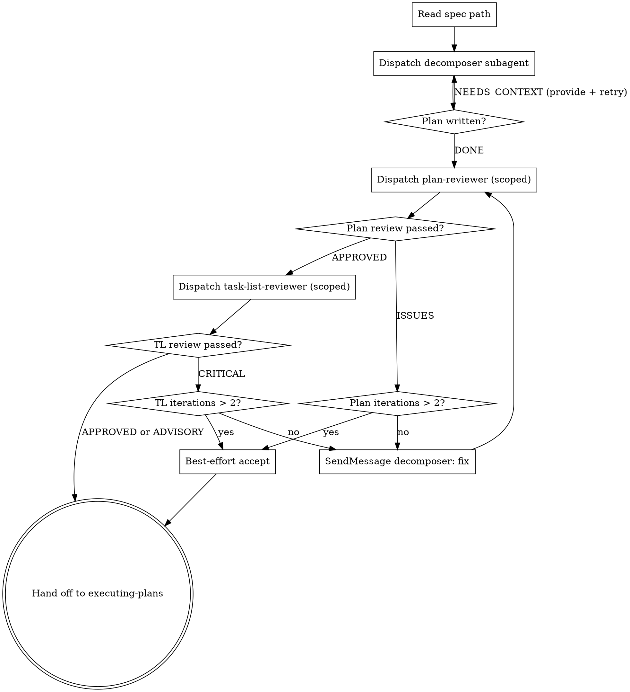

# Decomposing Specs into Task Plans

Convert a design spec (from `writing-specs`) into a multi-file phased task plan. Output: a directory `docs/plans/YYYY-MM-DD-<topic>/` containing `plan.md`, `standards.md`, and `phases/NN-<name>.md` files. This skill is a thin orchestrator — it dispatches a `decomposer` subagent to do the actual work in its own context, then runs scoped reviews on the artifacts. Hands off to `executing-plans`.

## Why this is structured as subagent dispatch

The decomposer reads the spec, explores the codebase, drafts the plan, writes standards, and emits per-phase files. Doing all that in the main agent's context bloats it with file reads and intermediate drafts that downstream orchestration doesn't need. The subagent pattern keeps the main context clean — only paths and a short summary come back.

The output is also split across files (multi-file plan, JIT phase elaboration) so reviewers and the executor only ever load the slice of the plan they need.

## Process



## Step 1: Dispatch the decomposer subagent

Pick the output directory: `docs/plans/YYYY-MM-DD-<topic>/`. The decomposer creates it.

Dispatch the `decomposer` agent with this brief:

```
Spec path: docs/plans/<topic>-design.md
Output directory: docs/plans/<topic>/
Repo root: <pwd>

Read the spec, explore the codebase, and produce:
- docs/plans/<topic>/plan.md (TOC, phase summaries, coverage matrix)
- docs/plans/<topic>/standards.md (codebase context shared across phases)
- docs/plans/<topic>/phases/01-<name>.md (fully elaborated)
- docs/plans/<topic>/phases/NN-verification.md (fully elaborated)
- docs/plans/<topic>/phases/0K-<name>.md for K in 2..N-1 (sketches only)

Self-check structural rules before returning. Return paths and a summary — do not paste file contents back.
```

The decomposer's instructions live in `agents/decomposer.md` — do not duplicate them in the dispatch prompt.

If it returns NEEDS_CONTEXT with questions, resolve them (ask the user if you must) and re-dispatch the same subagent with the answers.

## Step 2: Plan Review (scoped)

Dispatch the `plan-reviewer` agent in **scoped mode**:

```
Spec path: docs/plans/<topic>-design.md
Plan path: docs/plans/<topic>/plan.md
Standards path: docs/plans/<topic>/standards.md
Elaborated phase paths:
  - docs/plans/<topic>/phases/01-<name>.md
  - docs/plans/<topic>/phases/NN-verification.md

Mode: scoped — review only the elaborated phases plus the top-level plan and standards. Sketched phases (02..N-1) are intentionally not yet elaborated; they will be reviewed when the phase-elaborator fleshes them out at execution time.
```

The reviewer checks: requirement coverage (across the matrix in plan.md), TDD enforcement (in elaborated phases), CI verification (in the Verification phase file), and idiomatic-code citations (every elaborated task cites standards.md and lists deltas, with reuse-first justifications).

- **APPROVED** → proceed to Step 3.
- **ISSUES FOUND** → continue the same `decomposer` subagent via `SendMessage` with the findings. The decomposer fixes in-place. Re-run plan-reviewer (continue the same agent — it knows what it flagged). **Max 2 iterations**, then accept best-effort and proceed.

## Step 3: Task List Review (scoped)

Dispatch the `task-list-reviewer` agent in **scoped mode**:

```
Spec path: docs/plans/<topic>-design.md
Plan path: docs/plans/<topic>/plan.md
Elaborated phase paths: <as above>

Mode: scoped — cross-artifact consistency check across the plan TOC, coverage matrix, standards, and elaborated phases. Sketched phases participate via the coverage matrix only (their EARS coverage and task titles).
```

- **APPROVED or ADVISORY** → hand off to `executing-plans`.
- **CRITICAL_FINDINGS** → continue the same `decomposer` subagent with the findings. **Max 2 iterations**, then accept best-effort and proceed.

## Why two iterations instead of three

The decomposer's own self-check (in its agent definition) catches the most common structural problems before the reviewer ever sees the artifact. Reviewer iterations exist to catch what the self-check misses; if two passes don't converge, the issue is usually ambiguity in the spec, not iteration count. Best-effort acceptance lets `executing-plans` continue and flags concerns to the user.

## Hand-off to executing-plans

Pass the **plan directory path**, not the file contents. The executor loads `plan.md` and reads phase files on demand.

```
Plan dir: docs/plans/<topic>/
```

## Common Mistakes

| Mistake | Fix |
|---------|-----|
| Doing decomposition in main context instead of dispatching the decomposer subagent | This skill is a dispatcher. Don't read the spec file or explore the codebase yourself — that's what the subagent is for. |
| Pasting file contents into the dispatch prompt | The decomposer reads the spec from disk. Pass the path. |
| Pre-elaborating phases 2..N-1 to "save a step" | Sketches reflect post-Phase-1 codebase reality at elaboration time. Pre-elaborating defeats JIT. |
| Reviewing all phase files at decomposition time | Review only elaborated phases (Phase 1 + Verification). The phase-elaborator handles per-phase review later. |
| Burning iterations on fixes the self-check should have caught | The decomposer self-checks. If it returns DONE but fails review on a self-check item, fix the agent definition, not the iteration cap. |
| Continuing review iterations past 2 | Two iterations is the cap. Best-effort acceptance is the right move beyond that. |
