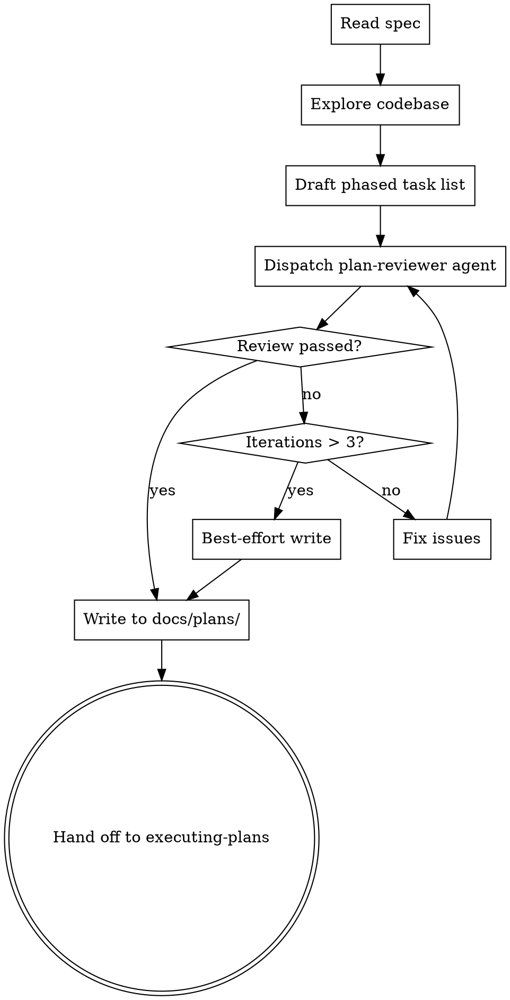

# Decomposing Specs into Task Lists

Convert a design spec (from `writing-specs`) into a phased, TDD-enforced task list. Output: `docs/plans/YYYY-MM-DD-<topic>-tasks.md`. This skill produces the artifact then hands off to `executing-plans`. No human review gate — this runs autonomously.

## Process



## Step 1: Read Spec & Explore Codebase

Extract from the spec: summary, EARS requirements (your completeness checklist), system design, libraries, and verification commands.

Explore the codebase: project structure, build system, test framework, existing patterns, files to modify vs. create, CI configuration.

For each task you'll create, identify the codebase context the implementer needs. **This is not optional fluff — it is the mechanism by which the plan steers the implementer toward idiomatic code.** For every task, you must be able to name:

- **Pattern file to mirror** — a concrete file in the repo that implements a similar thing. "Follow the pattern in `src/handlers/foo.ts`" with one sentence describing *which* part of the pattern matters.
- **Helpers/utilities to reuse** — specific functions, classes, or modules that already exist and should be called rather than reimplemented. Cite the file and symbol.
- **Naming & style conventions in-play** — how this area of the codebase names files, functions, tests, and variables (e.g., `camelCase` test names, `kebab-case` filenames, fixture naming under `tests/fixtures/`).
- **Interfaces to conform to** — existing types, traits, or contracts the new code must implement or accept.

If you can't cite a specific file or symbol for any of these, spend more time exploring — dispatch an Explore subagent if needed. "Follow existing patterns" without a file path is a failure mode, not codebase context.

### Reuse-First Principle

Before a task introduces a new helper, utility, or abstraction, the plan must justify — in writing, inside the task — why no existing utility fits. Default to reuse; additions require a reason. Bake this rule into every task so the implementer inherits it.

## Step 2: Draft the Task List

### Output Format

```markdown
# [Feature Name] Task Decomposition

> **Source spec:** `docs/plans/YYYY-MM-DD-<topic>-design.md`
> **Generated:** YYYY-MM-DD

**Goal:** [One sentence from spec summary]

**Phases:**
1. [Phase name] — [Purpose]
2. ...
N. Verification — CI and integration checks
```

### Phases

Derive phases from the spec — a bugfix may need one, a new project may need five. The final phase is always **Verification** (full CI checks). All tasks execute sequentially, top to bottom.

### Task Template

Each task is 1 to 2 hours containing the full TDD cycle. All verification commands must be specific — not generic. Implementation steps provide EARS requirements, codebase context, and key interfaces. Code snippets, pseudo-code, or complete test cases may be included to clarify requirements. The implementer decides *how*; the plan decides *what* and *why*.

```markdown
### Task N: [Short description]

**Files:**
- Create: `exact/path/to/file.ts`
- Modify: `exact/path/to/existing.ts`
- Test: `tests/exact/path/to/test.ts`

**Codebase context:** *(all four subsections required — no generic entries)*
- **Pattern to mirror:** `src/existing/similar.ts` — describe which aspect (error handling shape, request/response flow, state machine layout, etc.) the new code should copy.
- **Reuse:** call `existingHelper()` from `src/utils/helpers.ts` for X; use `ExistingValidator` from `src/validation/index.ts` for Y. Do not reimplement.
- **Conventions:** file naming (e.g., `kebab-case.ts`), test naming (e.g., `describe('FooService', ...)`), fixture location (`tests/fixtures/<feature>/`), import ordering (if enforced).
- **Interfaces to conform to:** `ExistingInterface` from `src/types.ts`; error type `AppError` from `src/errors.ts`.

**Reuse-first justification:** If this task introduces a new helper/utility/abstraction, name it here and explain why no existing utility fits. Otherwise: "No new helpers — reuses [listed utilities]."

- [ ] **Step 1: Write failing test**
  ```language
  test('specific behavior', () => {
    expect(myFunction(input)).toBe(expected);
  });
  ```

- [ ] **Step 2: Verify test fails**
  Run: `npm test -- tests/exact/path/to/test.ts`
  Expected: FAIL — "myFunction is not defined"

- [ ] **Step 3: Implement to satisfy requirements**
  Requirements:
  - WHEN [condition] THE SYSTEM SHALL [behavior] *(EARS-REQ-N)*
  - THE SYSTEM SHALL NOT [unwanted behavior] *(EARS-REQ-M)*

  Key interfaces (from spec, include only if pre-decided):
  ```language
  export interface MyInterface {
    field: Type;
  }
  ```

  Constraints:
  - [Non-obvious constraints: performance bounds, error handling, compatibility]
  - [Existing patterns or utilities to reuse]

- [ ] **Step 4: Verify test passes**
  Run: `npm test -- tests/exact/path/to/test.ts`
  Expected: PASS

- [ ] **Step 5: Commit**
  `git add src/path tests/path && git commit -m "feat: add myFunction"`
```

### Requirement Coverage Matrix

End the document with a traceability matrix. **Every EARS requirement from the spec must map to at least one task.** Missing coverage = add a task.

```markdown
## Requirement Coverage Matrix

| # | EARS Requirement | Task(s) |
|---|-----------------|---------|
| 1 | WHEN X THE SYSTEM SHALL Y | Task 3, Task 7 |
| 2 | THE SYSTEM SHALL NOT Z | Task 5 |
```

## Step 3: Review Loop

Dispatch the `plan-reviewer` agent with the draft task list path and source spec path. It audits: (1) requirement coverage, (2) TDD enforcement, (3) CI verification, (4) idiomatic-code checklist (every task cites concrete codebase context and reuse opportunities). Fix issues and re-dispatch. Max 3 iterations, then write best-effort result and proceed.

## Common Mistakes

| Mistake | Fix |
|---------|-----|
| Vague test steps ("write tests for X") | Complete, runnable test code |
| Missing failure expectations | Every "verify fails" step needs the expected error |
| Giant tasks (2+ hours) | Split until each is 30-60 minutes |
| No verification phase | Final phase must run full CI checks |
| No coverage matrix | Every EARS requirement must trace to a task |
| Generic commands (`npm test`) | Specific: `npm test -- tests/auth/login.test.ts` |
| Implementation before test | Every task starts with the failing test if the task is verifiable |
| Full implementation code in Step 3 | EARS requirements + codebase context + key interfaces only |
| Missing codebase context | Every task needs file paths, patterns, and interfaces the implementer will use |
| Generic codebase context ("follow existing patterns") without citing a file | Every task must name a concrete pattern file, specific helpers to reuse, conventions in-play, and interfaces to conform to |
| New helper added without justification | Every task must include a reuse-first justification — name why no existing utility fits, or state "no new helpers" |
