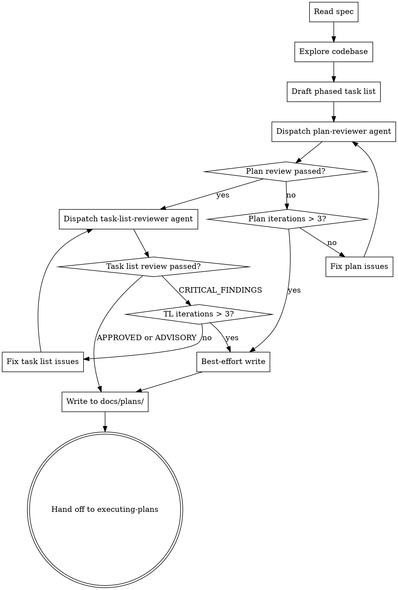

# Decomposing Specs into Task Lists

Convert a design spec (from `writing-specs`) into a phased, TDD-enforced task list. Output: `docs/plans/YYYY-MM-DD-<topic>-tasks.md`. This skill produces the artifact then hands off to `executing-plans`. No human review gate — this runs autonomously.

## Process



## Step 1: Read Spec & Explore Codebase

Extract from the spec: summary, EARS requirements (your completeness checklist), system design, libraries, and verification commands.

Explore the codebase: project structure, build system, test framework, existing patterns, files to modify vs. create, CI configuration.

For each task you'll create, identify the codebase context the implementer needs. **This is not optional fluff — it is the mechanism by which the plan steers the implementer toward idiomatic code.** For every task, you must be able to name:

- **Pattern file to mirror** — a concrete file in the repo that implements a similar thing. "Follow the pattern in `src/handlers/foo.ts`" with one sentence describing *which* part of the pattern matters.
- **Helpers/utilities to reuse** — specific functions, classes, or modules that already exist and should be called rather than reimplemented. Cite the file and symbol.
- **Naming & style conventions in-play** — how this area of the codebase names files, functions, tests, and variables (e.g., `camelCase` test names, `kebab-case` filenames, fixture naming under `tests/fixtures/`).
- **Interfaces to conform to** — existing types, traits, or contracts the new code must implement or accept.

If you can't cite a specific file or symbol for any of these, spend more time exploring — dispatch an Explore subagent if needed. "Follow existing patterns" without a file path is a failure mode, not codebase context.

### Reuse-First Principle

Before a task introduces a new helper, utility, or abstraction, the plan must justify — in writing, inside the task — why no existing utility fits. Default to reuse; additions require a reason. Bake this rule into every task so the implementer inherits it.

## Step 2: Draft the Task List

### Output Format

```markdown
# [Feature Name] Task Decomposition

> **Source spec:** `docs/plans/YYYY-MM-DD-<topic>-design.md`
> **Generated:** YYYY-MM-DD

**Goal:** [One sentence from spec summary]

**Phases:**
1. [Phase name] — [Purpose]
2. ...
N. Verification — CI and integration checks
```

### Phases

Derive phases from the spec — a bugfix may need one, a new project may need five. The final phase is always **Verification** (full CI checks). All tasks execute sequentially, top to bottom, unless marked for parallel execution (see below).

**Phase floor:** Each non-Verification phase must contain **at least 3 tasks**. A single-task or two-task phase wastes the entire phase-boundary review apparatus — merge it with the adjacent phase whose tasks share the most context. The only exception: a phase whose single task is genuinely high-risk (security boundary, data migration, public API contract) where you want full reviewers regardless of size — flag it explicitly with `**Risk:** high — solo phase justified` so the executor knows to keep it isolated.

### Parallel Markers

Tasks within a phase that have no dependencies on other tasks in the same phase may be marked with `[P]`:

```markdown
### Task 3 [P]: Add input validation
### Task 4 [P]: Add error formatting
### Task 5: Wire validation and formatting into handler  ← depends on 3 and 4
```

**Rules:**
- A `[P]` task must not read or write files that another `[P]` task in the same phase also modifies
- A `[P]` task must not depend on the output of another task in the same phase
- If dependency analysis is uncertain, do NOT mark the task as `[P]` — sequential is the safe default
- The marker is advisory — the orchestrator may still execute sequentially if concurrent dispatch is not available

### Task Sizing — Behavioral Slices, Not TDD Cycles

A task is a **cohesive behavioral slice**, not a single TDD cycle. One task may contain multiple test→implement→pass cycles internally if they advance the same capability. Aim for **1-3 hours of work per task**.

**Cohesion test — keep work in one task when:**
- The chunks touch the same module or overlapping file set
- They share the same pattern-to-mirror and codebase context
- They form one reviewable behavioral unit (e.g., "input validation + its error type + wiring into the handler" is one task, not three)

**Split into a new task only when:**
- The next chunk touches a different module/file area, OR
- It requires a different pattern-to-mirror, OR
- It depends on review feedback from the prior chunk landing first

Time alone is not a split signal. A 2-hour cohesive task beats three 40-minute fragmented tasks every time — the fragmented version pays full orchestration overhead (context block, codebase exploration, dispatch) per fragment.

**Anti-patterns to avoid:**
- One task per shell command (e.g., separate task for `pnpm add foo`)
- One task per file copy/config edit when several configs land together as one setup unit
- Splitting "validator + error type + caller wiring" across three tasks — that is one slice
- Splitting a single TDD cycle into "write test" / "implement" tasks

### Task Template

Each task contains 1-3 hours of work as a cohesive behavioral slice. All verification commands must be specific — not generic. Implementation steps provide EARS requirements, codebase context, and key interfaces. Code snippets, pseudo-code, or complete test cases may be included to clarify requirements. The implementer decides *how*; the plan decides *what* and *why*. A task may contain multiple TDD cycles and produce multiple commits.

```markdown
### Task N: [Short description]

**Files:**
- Create: `exact/path/to/file.ts`
- Modify: `exact/path/to/existing.ts`
- Test: `tests/exact/path/to/test.ts`

**Codebase context:** *(all four subsections required — no generic entries)*
- **Pattern to mirror:** `src/existing/similar.ts` — describe which aspect (error handling shape, request/response flow, state machine layout, etc.) the new code should copy.
- **Reuse:** call `existingHelper()` from `src/utils/helpers.ts` for X; use `ExistingValidator` from `src/validation/index.ts` for Y. Do not reimplement.
- **Conventions:** file naming (e.g., `kebab-case.ts`), test naming (e.g., `describe('FooService', ...)`), fixture location (`tests/fixtures/<feature>/`), import ordering (if enforced).
- **Interfaces to conform to:** `ExistingInterface` from `src/types.ts`; error type `AppError` from `src/errors.ts`.

**Reuse-first justification:** If this task introduces a new helper/utility/abstraction, name it here and explain why no existing utility fits. Otherwise: "No new helpers — reuses [listed utilities]."

**TDD cycles** *(one or more — list each cycle the slice contains; squash trivial config/setup cycles into a single cycle)*

- [ ] **Cycle A — [behavior name]**
  - Write failing test:
    ```language
    test('specific behavior', () => {
      expect(myFunction(input)).toBe(expected);
    });
    ```
  - Verify fails: `npm test -- tests/exact/path/to/test.ts` → FAIL "myFunction is not defined"
  - Implement to satisfy:
    - WHEN [condition] THE SYSTEM SHALL [behavior] *(EARS-REQ-N)*
    - THE SYSTEM SHALL NOT [unwanted behavior] *(EARS-REQ-M)*
  - Verify passes: `npm test -- tests/exact/path/to/test.ts` → PASS

- [ ] **Cycle B — [next behavior, if part of same slice]** *(omit if single-cycle)*
  - ... same shape ...

**Key interfaces** *(from spec, include only if pre-decided):*
```language
export interface MyInterface {
  field: Type;
}
```

**Constraints:**
- [Non-obvious constraints: performance bounds, error handling, compatibility]
- [Existing patterns or utilities to reuse]

- [ ] **Commit(s):** one commit per logical cycle, or one squashed commit for the whole slice if cycles are tightly coupled. Example: `git add src/path tests/path && git commit -m "feat: add input validation with error type"`
```

### Requirement Coverage Matrix

End the document with a traceability matrix. **Every EARS requirement from the spec must map to at least one task.** Missing coverage = add a task.

```markdown
## Requirement Coverage Matrix

| # | EARS Requirement | Task(s) |
|---|-----------------|---------|
| 1 | WHEN X THE SYSTEM SHALL Y | Task 3, Task 7 |
| 2 | THE SYSTEM SHALL NOT Z | Task 5 |
```

## Step 3: Review Loop

Two sequential reviews before the task list is finalized.

### Plan Review

Dispatch the `plan-reviewer` agent with the draft task list path and source spec path. It audits: (1) requirement coverage, (2) TDD enforcement, (3) CI verification, (4) idiomatic-code checklist (every task cites concrete codebase context and reuse opportunities). Fix issues and **continue the same agent** (via `SendMessage`) for re-review — it already knows what it flagged. Max 3 iterations, then write best-effort result and proceed.

### Task List Review

After the plan-reviewer passes, dispatch the `task-list-reviewer` agent with the spec path and task list path. It checks cross-artifact consistency: requirement inventory, orphan tasks, implicit assumptions, conflicts, and traceability gaps.

- **APPROVED or ADVISORY** → proceed to write the task list. ADVISORY findings (MAJOR/MINOR) are noted in the task list header as warnings but do not block.
- **CRITICAL_FINDINGS** → fix the specific issues cited, then **continue the same agent** for re-review. Max 3 iterations, then write best-effort result and proceed.

## Common Mistakes

| Mistake | Fix |
|---------|-----|
| Vague test steps ("write tests for X") | Complete, runnable test code |
| Missing failure expectations | Every "verify fails" step needs the expected error |
| Over-fragmented tasks (each <30 min, single shell command, one config file, one helper) | Merge into a behavioral slice — same module, same pattern, same review boundary = one task |
| Splitting validator + error type + caller wiring across separate tasks | One behavioral slice = one task, even if it spans 2-3 files |
| Splitting "write test" and "implement" into separate tasks | A TDD cycle is internal to a task, not a task split |
| Single-task or two-task phases | Merge with adjacent phase, or mark `**Risk:** high — solo phase justified` if isolation is genuinely needed |
| No verification phase | Final phase must run full CI checks |
| No coverage matrix | Every EARS requirement must trace to a task |
| Generic commands (`npm test`) | Specific: `npm test -- tests/auth/login.test.ts` |
| Implementation before test | Every task starts with the failing test if the task is verifiable |
| Full implementation code in Step 3 | EARS requirements + codebase context + key interfaces only |
| Missing codebase context | Every task needs file paths, patterns, and interfaces the implementer will use |
| Generic codebase context ("follow existing patterns") without citing a file | Every task must name a concrete pattern file, specific helpers to reuse, conventions in-play, and interfaces to conform to |
| New helper added without justification | Every task must include a reuse-first justification — name why no existing utility fits, or state "no new helpers" |
| No parallel markers on independent tasks | Analyze task dependencies within each phase; mark truly independent tasks with `[P]` |
| Skipping task list review | Always run `task-list-reviewer` after `plan-reviewer` passes |
