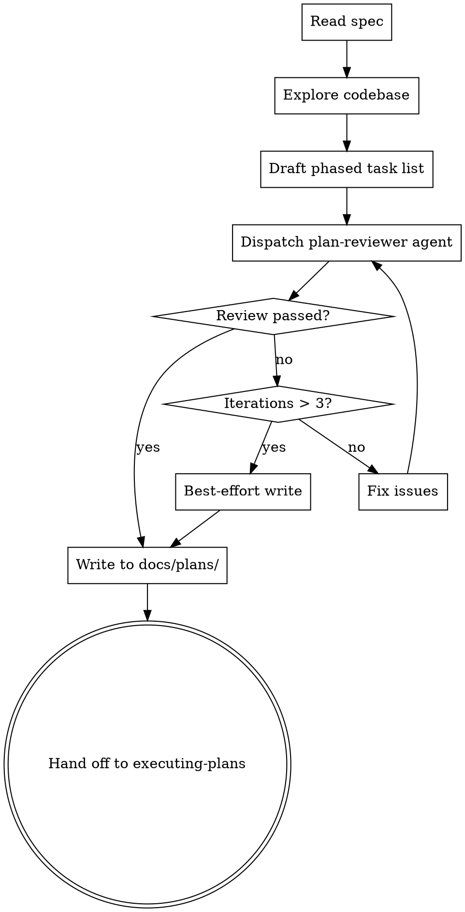

# Decomposing Specs into Task Lists

Convert a design spec (from `writing-specs`) into a phased, TDD-enforced task list. Output: `docs/plans/YYYY-MM-DD-<topic>-tasks.md`. This skill produces the artifact then hands off to `executing-plans`. No human review gate — this runs autonomously.

## Process



## Step 1: Read Spec & Explore Codebase

Extract from the spec: summary, EARS requirements (your completeness checklist), system design, libraries, and verification commands.

Explore the codebase: project structure, build system, test framework, existing patterns, files to modify vs. create, CI configuration.

## Step 2: Draft the Task List

### Output Format

```markdown
# [Feature Name] Task Decomposition

> **Source spec:** `docs/plans/YYYY-MM-DD-<topic>-design.md`
> **Generated:** YYYY-MM-DD

**Goal:** [One sentence from spec summary]

**Phases:**
1. [Phase name] — [Purpose]
2. ...
N. Verification — CI and integration checks
```

### Phases

Derive phases from the spec — a bugfix may need two, a new project may need five. The final phase is always **Verification** (full CI checks). All tasks execute sequentially, top to bottom.

### Task Template

Each task is 30-60 minutes containing the full TDD cycle. All code must be complete and runnable — not pseudocode. All commands must be specific — not generic.

```markdown
### Task N: [Short description]

**Files:**
- Create: `exact/path/to/file.ts`
- Modify: `exact/path/to/existing.ts`
- Test: `tests/exact/path/to/test.ts`

- [ ] **Step 1: Write failing test**
  ```language
  test('specific behavior', () => {
    expect(myFunction(input)).toBe(expected);
  });
  ```

- [ ] **Step 2: Verify test fails**
  Run: `npm test -- tests/exact/path/to/test.ts`
  Expected: FAIL — "myFunction is not defined"

- [ ] **Step 3: Implement minimal code**
  ```language
  export function myFunction(input: InputType): OutputType {
    return expected;
  }
  ```

- [ ] **Step 4: Verify test passes**
  Run: `npm test -- tests/exact/path/to/test.ts`
  Expected: PASS

- [ ] **Step 5: Commit**
  `git add src/path tests/path && git commit -m "feat: add myFunction"`
```

### Requirement Coverage Matrix

End the document with a traceability matrix. **Every EARS requirement from the spec must map to at least one task.** Missing coverage = add a task.

```markdown
## Requirement Coverage Matrix

| # | EARS Requirement | Task(s) |
|---|-----------------|---------|
| 1 | WHEN X THE SYSTEM SHALL Y | Task 3, Task 7 |
| 2 | THE SYSTEM SHALL NOT Z | Task 5 |
```

## Step 3: Review Loop

Dispatch the `plan-reviewer` agent with the draft task list path and source spec path. It audits: (1) requirement coverage, (2) TDD enforcement, (3) CI verification. Fix issues and re-dispatch. Max 3 iterations, then write best-effort result and proceed.

## Common Mistakes

| Mistake | Fix |
|---------|-----|
| Vague test steps ("write tests for X") | Complete, runnable test code |
| Missing failure expectations | Every "verify fails" step needs the expected error |
| Giant tasks (2+ hours) | Split until each is 30-60 minutes |
| No verification phase | Final phase must run full CI checks |
| No coverage matrix | Every EARS requirement must trace to a task |
| Generic commands (`npm test`) | Specific: `npm test -- tests/auth/login.test.ts` |
| Implementation before test | Every task starts with the failing test |
