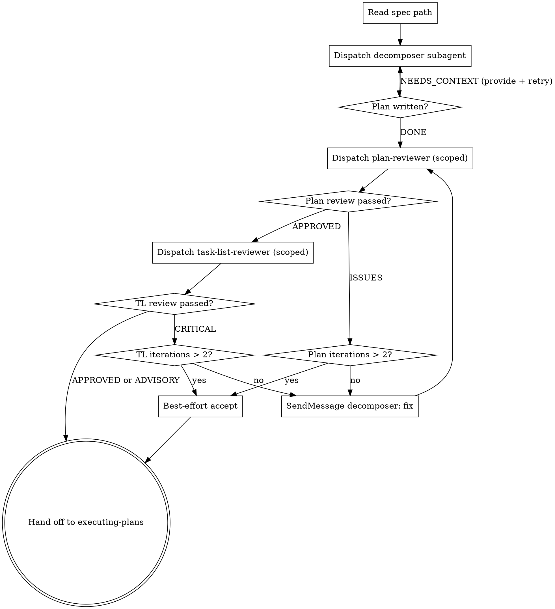

# Flow: decomposing-specs

State machine for the decomposition orchestration loop. Read this for orientation; it does not contain rules — those are in `SKILL.md`.

```dot
digraph decompose {
    "Read spec path" [shape=box];
    "Dispatch decomposer subagent" [shape=box];
    "Plan written?" [shape=diamond];
    "Dispatch plan-reviewer (scoped)" [shape=box];
    "Plan review passed?" [shape=diamond];
    "SendMessage decomposer: fix" [shape=box];
    "Plan iterations > 2?" [shape=diamond];
    "Dispatch task-list-reviewer (scoped)" [shape=box];
    "TL review passed?" [shape=diamond];
    "TL iterations > 2?" [shape=diamond];
    "Best-effort accept" [shape=box];
    "Hand off to executing-plans" [shape=doublecircle];

    "Read spec path" -> "Dispatch decomposer subagent";
    "Dispatch decomposer subagent" -> "Plan written?";
    "Plan written?" -> "Dispatch plan-reviewer (scoped)" [label="DONE"];
    "Plan written?" -> "Dispatch decomposer subagent" [label="NEEDS_CONTEXT (provide + retry)"];
    "Dispatch plan-reviewer (scoped)" -> "Plan review passed?";
    "Plan review passed?" -> "Dispatch task-list-reviewer (scoped)" [label="APPROVED"];
    "Plan review passed?" -> "Plan iterations > 2?" [label="ISSUES"];
    "Plan iterations > 2?" -> "SendMessage decomposer: fix" [label="no"];
    "Plan iterations > 2?" -> "Best-effort accept" [label="yes"];
    "SendMessage decomposer: fix" -> "Dispatch plan-reviewer (scoped)";
    "Dispatch task-list-reviewer (scoped)" -> "TL review passed?";
    "TL review passed?" -> "Hand off to executing-plans" [label="APPROVED or ADVISORY"];
    "TL review passed?" -> "TL iterations > 2?" [label="CRITICAL"];
    "TL iterations > 2?" -> "SendMessage decomposer: fix" [label="no"];
    "TL iterations > 2?" -> "Best-effort accept" [label="yes"];
    "Best-effort accept" -> "Hand off to executing-plans";
}
```
