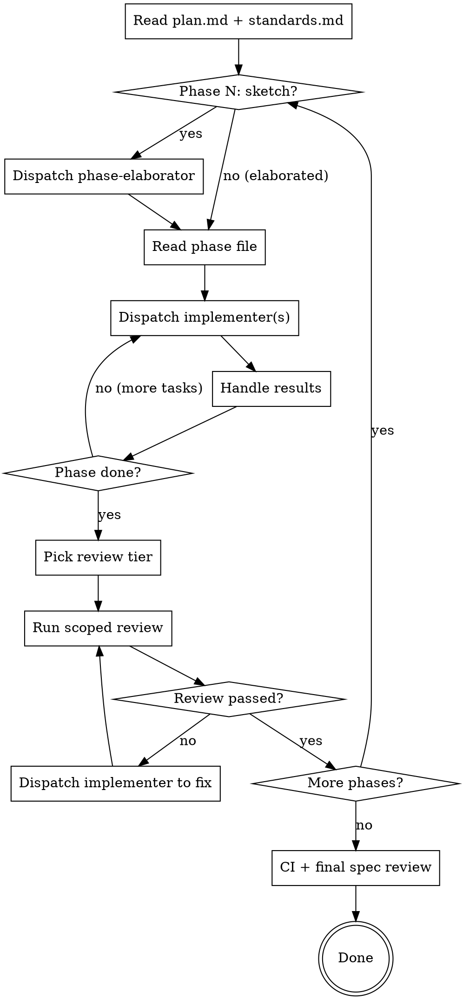

# Executing Plans

Orchestrate execution of a multi-file plan produced by `decomposing-specs`. The plan lives at `docs/plans/<topic>/` with `plan.md`, `standards.md`, and `phases/NN-<name>.md` files. Phase 1 and Verification are pre-elaborated; phases 2..N-1 start as sketches and are elaborated just-in-time. The orchestrator never writes code — it only coordinates.

**Efficiency posture:** subagent dispatch is expensive. Load only what you need (plan.md + the active phase file), batch consecutive cohesive tasks, scale phase-boundary review to phase size, and gate re-reviews on severity. Reviewer cycles can outnumber implementer cycles if you're not careful.

## Process



## Step 1: Setup

Read **only** these two files into context at startup:

- `docs/plans/<topic>/plan.md` — phases table, summaries, coverage matrix
- `docs/plans/<topic>/standards.md` — shared codebase context

Do **not** read all phase files at startup. Each phase file is loaded only when its turn comes.

Extract from `plan.md`:
- Ordered list of phases with file paths and status (elaborated | sketch)
- Coverage matrix (full EARS list mapped to phases + tentative task numbers)
- Source spec path

## Step 2: Per-Phase Loop

For each phase in order:

### 2a. Elaborate if needed

If the phase status is `sketch`, dispatch the `phase-elaborator` agent:

```
Spec path: <from plan.md>
Plan path: docs/plans/<topic>/plan.md
Standards path: docs/plans/<topic>/standards.md
Phase file path: docs/plans/<topic>/phases/NN-<name>.md
Prior phase summary: <one paragraph: what phase N-1 actually built — files created/modified, key decisions, any drift from its sketch>
Repo root: <pwd>
```

The elaborator overwrites the sketch in-place and returns a short summary. If it reports drift (anticipated files turned out wrong, EARS coverage shift, task count changed), update `plan.md`'s phase row + coverage matrix accordingly. If the drift is structural (new dependency between phases, scope change), pause and surface to the user.

If the phase is already `elaborated` (Phase 1 or Verification), skip this step.

### 2b. Read the phase file

Read `docs/plans/<topic>/phases/NN-<name>.md` into context now. This is the only phase file in your context — older phase files were dropped after their phase completed (they're on disk if needed).

### 2c. Execute tasks

Walk tasks top to bottom within the phase. For each task (or batch — see below), dispatch the `implementer` agent with:

1. **Task text** — full content from the phase file (files, codebase context deltas, TDD cycles, code snippets). For a batch, inline all tasks in order.
2. **Standards reference** — paste the relevant rows from `standards.md` (or hand the path; small files are fine to inline). Implementers must cite standards.md for shared context but only act on the deltas in the task.
3. **Context** — what this task is building toward, what prior tasks built, relevant architectural decisions from the spec
4. **Constraints** — working directory, commit conventions, files not to touch

#### Batched Task Dispatch (sequential)

**Default to batching** when consecutive sequential tasks within a phase share context. One implementer running 2-4 cohesive tasks is dramatically cheaper than 2-4 separate dispatches — context loads once.

Batch consecutive tasks N..N+k when ALL of these hold:
- Same phase, in order, no `[P]` markers between them
- Their `Files:` lists overlap by ≥50%, OR they share the same pattern-to-mirror citation
- Combined work ≤4 hours of implementer time (roughly 2-4 tasks)
- No task in the batch is flagged `**Risk:** high`

The implementer reports per-task DONE/BLOCKED in the result. If any task in the batch returns BLOCKED or NEEDS_CONTEXT, the implementer reports which task and what it completed; resume the rest as a smaller batch or individual dispatch.

Do NOT batch when tasks touch disjoint subsystems, an intermediate task is high-risk, or a task is flagged `**Risk:** high`.

#### Parallel Task Dispatch

Tasks marked `[P]` within a phase have no intra-phase dependencies and may be dispatched concurrently:

1. Identify all `[P]` tasks in the phase
2. **Bundle small `[P]` tasks before parallelizing.** If two `[P]` tasks are each <1 hour and touch disjoint files, hand both to a single implementer to run sequentially. Reserve concurrent dispatch for `[P]` tasks ≥1 hour each or that benefit from isolation.
3. Dispatch the resulting set (some bundled, some solo) concurrently
4. Wait for all to complete before proceeding
5. Non-`[P]` tasks execute sequentially (or batched) after all parallel tasks complete

If any parallel task fails or blocks, handle individually — don't block the others. Concurrent dispatch is advisory; sequential is the safe fallback.

#### Handling Implementer Results

| Status | Response |
|--------|----------|
| **DONE** | Proceed to next task or phase review |
| **DONE_WITH_CONCERNS** | Read concerns. Correctness/scope issues → dispatch fix. Observations → note and proceed. |
| **NEEDS_CONTEXT** | Provide missing context (often a row from standards.md), re-dispatch same task |
| **BLOCKED** | Context problem → provide more context. Too hard → break task down. Plan wrong → generate fix task or re-elaborate phase. |

If an implementer fails the same task 3 times, stop execution and report to the user.

### 2d. Phase boundary review

After all tasks in the phase complete, scale review depth to phase size and risk.

#### Review Tier Selection

| Phase shape | Review tier |
|-------------|-------------|
| 1-2 tasks, no `**Risk:** high` flag | **Tier A — defer.** Skip phase-boundary review entirely. The final spec-reviewer pass at Step 3 covers correctness; design/security/test concerns fold into the next phase's review or the final pass. |
| 1-2 tasks BUT flagged `**Risk:** high` | **Tier B — focused.** Dispatch only the reviewers relevant to the risk (e.g., `security-reviewer` + `correctness-reviewer` for an auth boundary). Skip the full 4-agent suite. |
| 3+ tasks, normal risk | **Tier C — full suite** (4 reviewers in parallel + test-coverage-reviewer). |
| 3+ tasks, includes `**Risk:** high` | **Tier C** with extra weight on the relevant specialized reviewer. |

#### Stage 1: Parallel Code Review (Tier C)

Dispatch all 4 specialized reviewers in parallel, each with the files changed during the phase, the phase file (for plan alignment), and the standards file (for convention reference):

1. `correctness-reviewer` — plan alignment, logic, completeness, edge cases
2. `design-reviewer` — patterns, naming, reuse, deduplication, complexity
3. `security-reviewer` — vulnerabilities, input validation, auth, secrets
4. `test-quality-reviewer` — assertion quality, test design, edge cases, anti-patterns

Wait for all 4. Aggregate and deduplicate findings: when multiple reviewers flag the same file:line, merge into one finding noting which reviewers reported it.

- ALL APPROVED → proceed to Stage 2
- ANY ISSUES → dispatch implementer with deduplicated findings, then **continue the same reviewer agents** via `SendMessage` for re-review. Only re-run reviewers that failed.
- **Severity-gated re-review.** Only re-dispatch a reviewer when its findings include CRITICAL or MAJOR. MINOR/style/nit findings are noted in the phase report and not re-reviewed — they fold into final spec review or are accepted.
- **Re-review fix cap: 2 cycles per phase.** After 2 cycles, accept remaining MAJOR-and-below findings as noted concerns. CRITICAL findings still block — escalate to user.

#### Stage 2: Test Coverage Review

After code review passes, dispatch `test-coverage-reviewer` with:
- EARS requirements mapped to this phase (from the coverage matrix in plan.md)
- Files changed during the phase
- Test files created during the phase

PASS → proceed to next phase. FAIL → dispatch implementer to write missing tests, continue the same coverage reviewer for re-check. Max 2 fix cycles.

**Skip Stage 2 in Tier A.** The final spec-reviewer at Step 3 covers requirement-to-test mapping for deferred phases.

**Spec compliance is not checked at phase boundaries** — only at Step 3 (final validation).

### 2e. Drop the phase file

After phase review passes, the phase file's contents are no longer needed in context. The next phase's elaboration + reading replaces it. (You don't have to actively unload — just don't carry phase N's task text forward.)

## Step 3: Final Validation

After all phases complete, run two-stage final validation.

### Stage 1: CI Verification

Run the project's full test suite, linter, formatter, and typechecker (commands from `standards.md`). If anything fails, dispatch implementer to fix. Repeat until green or 3 attempts, then report to user.

### Stage 2: Full Spec Compliance

Different from phase reviews. Phase reviews check "did we build what the plan said?" This checks "did we satisfy the original spec?"

Dispatch `spec-reviewer` with:
- Complete EARS requirements list from the source spec (not the plan)
- Coverage matrix from plan.md
- All files created or modified during execution

It validates:
- Every EARS requirement has a working implementation
- No requirement was lost between spec → plan → code
- Spec non-goals and constraints are not broken

**Deviation tolerance:** implementations that deviate from the plan are acceptable if the EARS requirement is satisfied and no unrelated functionality breaks.

### Remediation

If gaps are found:

1. Take the unmet requirements
2. Generate supplementary tasks (use the elaborated phase format — TDD cycles, codebase context deltas, commands)
3. Execute them sequentially with the same implementer dispatch pattern
4. Re-run CI verification, then final spec review

Max 3 remediation cycles. If gaps remain, escalate to auto-debugger.

### Auto-Debug Escalation

Dispatch `auto-debugger` as a last resort. Provide:

- Source spec (EARS requirements)
- Spec-reviewer's failure report
- All files created or modified during execution
- CI output (if relevant)

**Critical: auto-debugger gets fresh context** — do NOT continue an existing agent or include prior remediation history. Phase-boundary reviewers reuse context for focused re-checks; auto-debugger is the opposite. Fresh context avoids retry loops.

#### Handling the Verdict

| Verdict | Interactive (user present) | Autonomous (coder-task) |
|---------|---------------------------|-------------------------|
| `RETRY_TASK` | Dispatch new implementer with fix plan + current diff, re-run final validation (one attempt) | Same |
| `BLOCK_TASK` | Mark task blocked with root cause, continue with remaining work, report blocked items at end | Same |
| `NEEDS_HUMAN` | Stop, report root-cause analysis, wait for guidance | **Do NOT stop.** Post root-cause analysis + specific questions to the GitHub issue. Treat affected tasks as `BLOCK_TASK`. Continue with remaining unblocked work. Note the gap in the PR description. |

## Common Mistakes

| Mistake | Fix |
|---------|-----|
| Reading all phase files at startup | Load only `plan.md` and `standards.md` initially. Phase files load one at a time when their turn comes. |
| Executing a sketched phase without elaborating | If `plan.md` shows status `sketch` for the upcoming phase, dispatch `phase-elaborator` first. |
| Pre-elaborating future phases speculatively | Phases stay sketched until their turn. The codebase changes between phases; speculative elaboration goes stale. |
| Ignoring elaborator drift reports | If phase-elaborator reports the sketch was wrong, update plan.md's phase row + coverage matrix before continuing. |
| Orchestrator writes code itself | Only dispatch agents — never write code |
| One implementer dispatch per task when consecutive tasks share context | Batch consecutive cohesive tasks (≤4 hrs, overlapping files) into one implementer call |
| Running the full 4-agent suite on a 1-task phase | Use Tier A (defer); the final spec-reviewer covers correctness anyway |
| Re-dispatching reviewers for MINOR findings | Severity-gate re-review to CRITICAL/MAJOR only |
| Two `[P]` tasks each <1 hr dispatched as two parallel agents | Bundle into one implementer running sequentially |
| Re-running all reviewers when only some failed | Only re-run reviewers that returned ISSUES |
| Running spec-reviewer at a phase boundary | Spec compliance is checked only during final validation |
| Pasting the plan directory path instead of task text into the implementer prompt | Inline the task block + relevant standards rows. Implementers don't read plan files. |
| Ignoring DONE_WITH_CONCERNS | Read concerns before deciding to proceed |
| Retrying a blocked implementer without changes | Change something: more context, smaller task, or re-elaborate the phase |
| Final review checks plan compliance, not spec | Final review must check EARS requirements from the spec |
| Including prior attempts in auto-debugger prompt | Auto-debugger must get fresh context — spec, failures, code only |
| Blocking all parallel tasks when one fails | Handle parallel task failures individually after all resolve |
