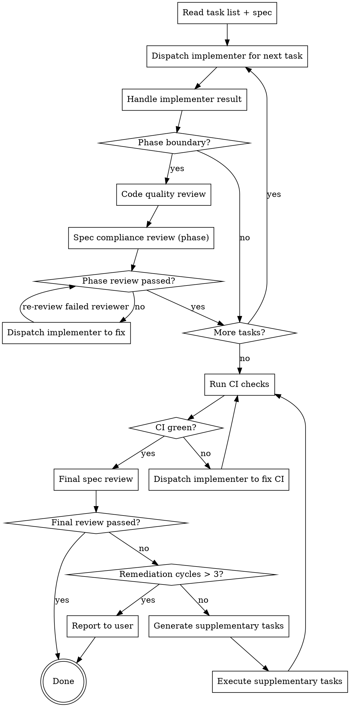

# Executing Plans

Orchestrate execution of a task list produced by `decomposing-specs`. Dispatch one implementer subagent per task, review at phase boundaries, and validate the full spec at the end. The orchestrator never writes code — it only coordinates.

## Process

## Step 1: Setup

Read the task list and source spec once. Extract:

- All tasks grouped by phase
- All EARS requirements from the spec
- The coverage matrix
- CI commands (test, lint, format, typecheck)

## Step 2: Execute Tasks

Walk tasks sequentially, top to bottom. For each task, dispatch the `implementer` agent with an inline prompt containing:

1. **Task text** — full content from the plan (files, TDD steps, code snippets)
2. **Context** — what this task is building toward, what prior tasks built, relevant architectural decisions from the spec
3. **Constraints** — working directory, commit conventions, files not to touch

### Handling Implementer Results

| Status | Response |
|--------|----------|
| **DONE** | Proceed to next task or phase review |
| **DONE_WITH_CONCERNS** | Read concerns. Correctness/scope issues → dispatch fix. Observations → note and proceed. |
| **NEEDS_CONTEXT** | Provide missing context, re-dispatch same task |
| **BLOCKED** | Context problem → provide more context. Too hard → break task down. Plan wrong → generate fix task. |

If an implementer fails the same task 3 times, stop execution and report to the user.

## Step 3: Phase Reviews

At each phase boundary, dispatch two reviewers sequentially:

### 1. Code Quality Review (first)

Dispatch the `code-reviewer` agent with:
- Files changed during the phase
- Summary of what was built

Checks: code organization, naming, test quality, patterns, maintainability. Returns APPROVED or ISSUES with file:line references.

### 2. Spec Compliance Review (second)

Dispatch the `spec-reviewer` agent with:
- EARS requirements relevant to this phase (from coverage matrix)
- Files changed during the phase

Checks: does the implementation satisfy the requirements it claims to cover? Returns APPROVED or ISSUES with specific gaps.

**Why this order:** Fix quality issues first so the spec reviewer sees clean code.

### Handling Review Failures

1. Dispatch implementer with the specific issues and relevant files
2. Re-run only the reviewer that failed (not both)
3. Max 3 fix cycles per reviewer per phase, then proceed with noted concerns

## Step 4: Final Validation

After all phases complete, run a two-stage final validation.

### Stage 1: CI Verification

Run the project's full test suite, linter, and formatter. If anything fails, dispatch implementer to fix. Repeat until green or 3 attempts, then report to user.

### Stage 2: Full Spec Compliance

This is different from phase reviews. Phase reviews check "did we build what the plan said?" This checks "did we satisfy the original spec?"

Dispatch the `spec-reviewer` agent with:
- The complete EARS requirements list from the source spec (not the plan)
- The coverage matrix
- All files created or modified during execution

It validates:
- Every EARS requirement has a working implementation
- No requirement was lost in translation between spec → plan → code
- Nothing breaks the spec's non-goals or constraints

**Deviation tolerance:** Implementations that deviate from the plan's prescribed approach are acceptable if the EARS requirement is satisfied and no unrelated functionality is broken.

### Remediation

If the final review finds gaps:

1. Take the unmet requirements
2. Generate supplementary tasks (same format — TDD steps, code, commands)
3. Execute them sequentially with the same implementer dispatch pattern
4. Re-run CI verification, then final spec review

Max 3 remediation cycles. If gaps remain, report to the user with specific unmet requirements and what was attempted.

## Common Mistakes

| Mistake | Fix |
|---------|-----|
| Orchestrator writes code itself | Only dispatch agents — never write code |
| Skipping phase reviews | Every phase boundary gets quality + spec review |
| Re-running both reviewers when one failed | Only re-run the reviewer that found issues |
| Pasting the plan file path instead of task text | Inline everything — agents don't read plan files |
| Ignoring DONE_WITH_CONCERNS | Read concerns before deciding to proceed |
| Retrying a blocked implementer without changes | Change something: more context, smaller task, or different approach |
| Final review checks plan compliance, not spec | Final review must check EARS requirements from the spec |
