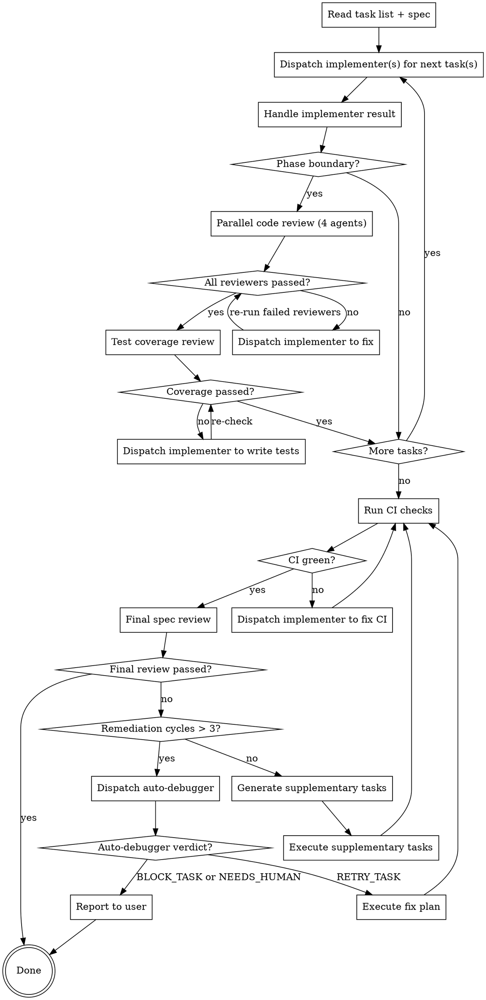

# Executing Plans

Orchestrate execution of a task list produced by `decomposing-specs`. Dispatch one implementer subagent per task, review at phase boundaries, and validate the full spec at the end. The orchestrator never writes code — it only coordinates.

## Process

## Step 1: Setup

Read the task list and source spec once. Extract:

- All tasks grouped by phase, noting any `[P]` parallel markers
- All EARS requirements from the spec
- The coverage matrix
- CI commands (test, lint, format, typecheck)

## Step 2: Execute Tasks

Walk tasks top to bottom within each phase. For each task, dispatch the `implementer` agent with an inline prompt containing:

1. **Task text** — full content from the plan (files, TDD steps, code snippets)
2. **Context** — what this task is building toward, what prior tasks built, relevant architectural decisions from the spec
3. **Constraints** — working directory, commit conventions, files not to touch

### Parallel Task Dispatch

Tasks marked with `[P]` within a phase have no intra-phase dependencies and may be dispatched concurrently:

1. At the start of each phase, identify all `[P]`-marked tasks
2. Dispatch all `[P]` tasks simultaneously (each to its own implementer agent)
3. Wait for all to complete before proceeding
4. Non-`[P]` tasks execute sequentially after all parallel tasks complete

If any parallel task returns BLOCKED or NEEDS_CONTEXT, handle it individually without blocking other parallel tasks. If a parallel task fails, the others may still proceed — handle failures after all parallel tasks resolve.

**Fallback:** If concurrent dispatch is not supported by the runtime, execute `[P]` tasks sequentially in order. The `[P]` marker is advisory.

### Handling Implementer Results

| Status | Response |
|--------|----------|
| **DONE** | Proceed to next task or phase review |
| **DONE_WITH_CONCERNS** | Read concerns. Correctness/scope issues → dispatch fix. Observations → note and proceed. |
| **NEEDS_CONTEXT** | Provide missing context, re-dispatch same task |
| **BLOCKED** | Context problem → provide more context. Too hard → break task down. Plan wrong → generate fix task. |

If an implementer fails the same task 3 times, stop execution and report to the user.

## Step 3: Phase Reviews

At each phase boundary, run two stages:

### Stage 1: Parallel Code Review (4 agents simultaneously)

Dispatch all 4 specialized reviewers in parallel, each with the files changed during the phase and a summary of what was built:

1. `correctness-reviewer` — plan alignment, logic, completeness, edge cases, boundary audit
2. `design-reviewer` — patterns, naming, reuse, deduplication, complexity
3. `security-reviewer` — vulnerabilities, input validation, auth, secrets
4. `test-quality-reviewer` — assertion quality, test design, edge case coverage, anti-patterns

Wait for all 4 to complete. Aggregate and deduplicate results: when multiple reviewers flag the same file:line, merge into a single finding and note which reviewers reported it. This prevents the implementer from receiving duplicate fix instructions.

- If ALL return APPROVED → proceed to Stage 2
- If ANY return ISSUES → dispatch implementer with the deduplicated findings from all reviewers that found issues, then **continue the same reviewer agents** (via `SendMessage`) rather than spawning fresh ones. The reviewer already knows what it flagged — a continued agent produces a more focused re-review ("did you fix the issue I reported?") and avoids re-reading all files from scratch. Only re-run reviewers that failed. Max 3 fix cycles per phase, then proceed with noted concerns.
- Critical findings from any reviewer block progression until resolved.

### Stage 2: Test Coverage Review

After code review passes, dispatch the `test-coverage-reviewer` agent with:
- EARS requirements mapped to tasks in the completed phase (from the coverage matrix)
- Files changed during the phase
- Test files created during the phase

Checks: for each requirement in this phase, does a test file exist with relevant test cases? For `SHALL CONTINUE TO` requirements, are verification anchors still present?

Returns PASS or FAIL with specific gaps. On FAIL, dispatch implementer to write the missing tests, then **continue the same test-coverage-reviewer agent** to re-check — it already knows which requirements lacked coverage. Max 2 fix cycles per phase, then proceed with noted gaps.

**Why this order:** Fix code quality issues first (they may affect which tests exist), then verify requirement-to-test coverage before moving on.

**Spec compliance is not checked at phase boundaries** — it is checked once during final validation (Step 4). Phase reviews focus on craft and coverage; final validation confirms the EARS requirements are met.

## Step 4: Final Validation

After all phases complete, run a two-stage final validation.

### Stage 1: CI Verification

Run the project's full test suite, linter, and formatter. If anything fails, dispatch implementer to fix. Repeat until green or 3 attempts, then report to user.

### Stage 2: Full Spec Compliance

This is different from phase reviews. Phase reviews check "did we build what the plan said?" This checks "did we satisfy the original spec?"

Dispatch the `spec-reviewer` agent with:
- The complete EARS requirements list from the source spec (not the plan)
- The coverage matrix
- All files created or modified during execution

It validates:
- Every EARS requirement has a working implementation
- No requirement was lost in translation between spec → plan → code
- Nothing breaks the spec's non-goals or constraints

**Deviation tolerance:** Implementations that deviate from the plan's prescribed approach are acceptable if the EARS requirement is satisfied and no unrelated functionality is broken.

### Remediation

If the final review finds gaps:

1. Take the unmet requirements
2. Generate supplementary tasks (same format — TDD steps, code, commands)
3. Execute them sequentially with the same implementer dispatch pattern
4. Re-run CI verification, then final spec review

Max 3 remediation cycles. If gaps remain after 3 cycles, escalate to auto-debugger (see below).

### Auto-Debug Escalation

If 3 remediation cycles are exhausted and gaps remain, dispatch the `auto-debugger` agent as a last resort. Provide it with:

- The source spec (EARS requirements)
- The spec-reviewer's failure report (which requirements failed and why)
- All files created or modified during execution
- CI output (if relevant)

**Critical: The auto-debugger must be a NEW agent with fresh context** — do NOT continue an existing agent or include prior remediation history. This is the opposite of the phase-boundary reviewers (which reuse context for focused re-checks). Fresh context avoids the "context pollution that causes infinite retry loops."

#### Handling the Verdict

| Verdict | Interactive (user present) | Autonomous (coder-task) |
|---------|---------------------------|-------------------------|
| `RETRY_TASK` | Dispatch new implementer with fix plan + current diff, re-run final validation (one attempt) | Same |
| `BLOCK_TASK` | Mark task as blocked with root cause, continue with remaining work, report blocked items at end | Same |
| `NEEDS_HUMAN` | Stop execution, report root-cause analysis to user, wait for guidance | **Do NOT stop.** Post root-cause analysis + specific questions to the GitHub issue. Treat all affected tasks as `BLOCK_TASK`. Continue with remaining unblocked work. Note the gap in the PR description. |

## Common Mistakes

| Mistake | Fix |
|---------|-----|
| Orchestrator writes code itself | Only dispatch agents — never write code |
| Running reviewers sequentially instead of in parallel | All 4 code reviewers dispatch simultaneously at each phase boundary |
| Re-running all reviewers when only some failed | Only re-run reviewers that returned ISSUES |
| Missing test coverage review at phase boundary | Always run `test-coverage-reviewer` after code review passes |
| Running spec-reviewer at a phase boundary | Spec compliance is checked only during final validation |
| Pasting the plan file path instead of task text | Inline everything — agents don't read plan files |
| Ignoring DONE_WITH_CONCERNS | Read concerns before deciding to proceed |
| Retrying a blocked implementer without changes | Change something: more context, smaller task, or different approach |
| Final review checks plan compliance, not spec | Final review must check EARS requirements from the spec |
| Including prior attempts in auto-debugger prompt | Auto-debugger must get fresh context — spec, failures, and code only |
| Blocking all parallel tasks when one fails | Handle parallel task failures individually after all resolve |
