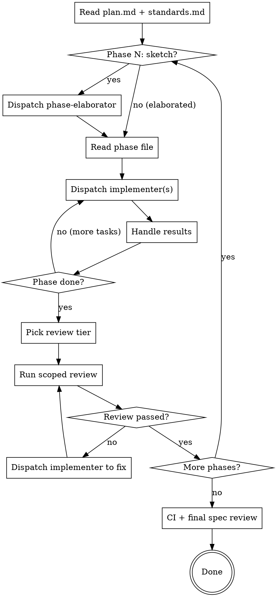

# Flow: executing-plans

State machine for the per-phase execution loop. Read this for orientation; rules live in `SKILL.md`.

```dot
digraph execute {
    "Read plan.md + standards.md" [shape=box];
    "Phase N: sketch?" [shape=diamond];
    "Dispatch phase-elaborator" [shape=box];
    "Read phase file" [shape=box];
    "Dispatch implementer(s)" [shape=box];
    "Handle results" [shape=box];
    "Phase done?" [shape=diamond];
    "Pick review tier" [shape=box];
    "Run scoped review" [shape=box];
    "Review passed?" [shape=diamond];
    "Dispatch implementer to fix" [shape=box];
    "More phases?" [shape=diamond];
    "CI + final spec review" [shape=box];
    "Done" [shape=doublecircle];

    "Read plan.md + standards.md" -> "Phase N: sketch?";
    "Phase N: sketch?" -> "Dispatch phase-elaborator" [label="yes"];
    "Phase N: sketch?" -> "Read phase file" [label="no (elaborated)"];
    "Dispatch phase-elaborator" -> "Read phase file";
    "Read phase file" -> "Dispatch implementer(s)";
    "Dispatch implementer(s)" -> "Handle results";
    "Handle results" -> "Phase done?";
    "Phase done?" -> "Dispatch implementer(s)" [label="no (more tasks)"];
    "Phase done?" -> "Pick review tier" [label="yes"];
    "Pick review tier" -> "Run scoped review";
    "Run scoped review" -> "Review passed?";
    "Review passed?" -> "More phases?" [label="yes"];
    "Review passed?" -> "Dispatch implementer to fix" [label="no"];
    "Dispatch implementer to fix" -> "Run scoped review";
    "More phases?" -> "Phase N: sketch?" [label="yes"];
    "More phases?" -> "CI + final spec review" [label="no"];
    "CI + final spec review" -> "Done";
}
```
