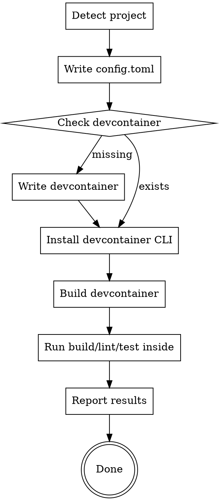

# Setup Code Factory

Configure a repository so Code Factory can run against it. Produces `.code-factory/config.toml`, ensures `.devcontainer/devcontainer.json` exists and is usable, then verifies the devcontainer builds and the project's build/lint/test commands run inside it.

The skill is idempotent — if any artifact already exists, treat it as authoritative and only fill gaps. Do not overwrite user-authored config without asking.

## Process



## 1. Detect project

Run these checks in parallel. Record findings — they drive every downstream decision.

**Primary language & build system** — look for:
- `package.json` → Node/TypeScript (read `engines.node`, scripts)
- `pyproject.toml`, `setup.py`, `requirements.txt` → Python
- `Cargo.toml` → Rust
- `go.mod` → Go
- `Gemfile` → Ruby
- `pom.xml`, `build.gradle` → JVM
- `*.csproj`, `*.sln` → .NET

If multiple are present, the one with the most source files wins; note the others as secondary.

**Nix** — any of: `flake.nix`, `flake.lock`, `shell.nix`, `default.nix` at the repo root, or a `.envrc` referencing `use flake` / `use nix`.

**Docker** — any `Dockerfile` (anywhere), `docker-compose.yml`, `docker-compose.yaml`, or `compose.yaml` in the repo.

**Build / lint / test / format commands** — pull from:
- `package.json` → `scripts` (look for `build`, `lint`, `test`, `format`, `typecheck`)
- `Makefile` → targets
- `justfile`, `Taskfile.yml`
- `CONTRIBUTING.md`, `README.md` (grep for install/test instructions)
- Language defaults (`cargo build`/`test`/`clippy`/`fmt`, `go build`/`test`/`vet`, `pytest`, `ruff`, etc.)

**LSPs needed** — infer from the primary language plus any file extensions with >5 files in the repo. Examples:
- TypeScript/JavaScript → `typescript-language-server`
- Python → `pyright`
- Rust → `rust-analyzer`
- Go → `gopls`
- Bash scripts present → `bash-language-server`
- Dockerfile present → `dockerfile-language-server-nodejs`
- Nix present → `nil` or `nixd`

## 2. Write `.code-factory/config.toml`

Config schema: https://code-factory-action.xmtp.team/schema.json

Create `.code-factory/config.toml` if it does not exist. If it does, read it, merge additions without clobbering user values, and ask before changing anything already set.

**Required rules:**
- **Nix detected** → add a `[[sandbox.volumes]]` entry with `path = "/nix/store"` and `size = "25Gi"`.
- **Docker detected** → set `sandbox.docker = true`.
- **Sandbox size** (default is `medium`; pick one based on the project):
  - Rust or Nix detected → `sandbox.size = "large"`. (Rust and Nix builds routinely exceed medium.)
  - Primary language is TypeScript/JavaScript or Python **and** Docker is **not** detected → `sandbox.size = "small"`.
  - Otherwise → leave `sandbox.size` at the default (emit it commented out — see below).
  - If rules collide (e.g. a TS project that also uses Nix), the `large` rule wins.
- **Include every other optional field as a commented-out line showing its schema default**, so users can see what's available without having to read the schema. Fields to scaffold:
  - `sandbox.size` (default `"medium"`) — uncomment only if a rule above sets it.
  - `sandbox.docker` (default `false`) — uncomment only if Docker is detected.
  - `harness.provider` (default `"claude_code"`).
  - `scheduled_jobs` (default `[]`).
  - `on_event.failed_run` (default `[]`).
  - Any `[[sandbox.volumes]]` entry beyond the Nix one is project-specific and should NOT be scaffolded.
- Prefix each commented default with `# default:` so intent is obvious (`# default: size = "medium"`).
- If the user has already set a value, never comment it out — respect existing config.

**Shapes:** every config scaffolds the full schema surface — defaults appear commented out, detected rules are uncommented and set.

Plain project (no docker, no nix, language outside the small/large rules — e.g. Go):
```toml
[sandbox]
default: size = "medium"
# default: docker = false

# [harness]
# default: provider = "claude_code"

# default: scheduled_jobs = []

# [[on_event.failed_run]]
# workflows = []
# branches = []
# prompt_additions = ""
```

Node/TypeScript project, no Docker:
```toml
[sandbox]
size = "small"
# default: docker = false

# [harness]
# default: provider = "claude_code"

# default: scheduled_jobs = []

# [[on_event.failed_run]]
# workflows = []
# branches = []
# prompt_additions = ""
```

Node project with Docker:
```toml
[sandbox]
# default: size = "medium"
docker = true

# [harness]
# default: provider = "claude_code"

# default: scheduled_jobs = []

# [[on_event.failed_run]]
# workflows = []
# branches = []
# prompt_additions = ""
```

Rust project with Nix:
```toml
[sandbox]
size = "large"
# default: docker = false

[[sandbox.volumes]]
path = "/nix/store"
size = "25Gi"

# [harness]
# default: provider = "claude_code"

# default: scheduled_jobs = []

# [[on_event.failed_run]]
# workflows = []
# branches = []
# prompt_additions = ""
```

Project with both Docker and Nix:
```toml
[sandbox]
size = "large"
docker = true

[[sandbox.volumes]]
path = "/nix/store"
size = "25Gi"

# [harness]
# default: provider = "claude_code"

# default: scheduled_jobs = []

# [[on_event.failed_run]]
# workflows = []
# branches = []
# prompt_additions = ""
```

After writing, validate the TOML parses (`python3 -c "import tomllib; tomllib.load(open('.code-factory/config.toml','rb'))"`).

## 3. Check / create `.devcontainer/devcontainer.json`

**If the file already exists, do not modify it — at all.** Read it, record the image and features, proceed to validation. If you see gaps (missing LSPs, missing docker feature, wrong moby setting, outdated image tag), surface them as *suggestions in your final report* for the user to apply themselves. Never edit, rewrite, merge, or "fix" an existing devcontainer.json without the user explicitly asking for that specific change. This includes reformatting, reordering keys, or adding comments.

The only exception is if validation in step 4 fails because of a container problem — even then, stop and ask the user before changing their devcontainer.json.

**If missing**, create `.devcontainer/devcontainer.json` with these guidelines:

### Base image

Use a Microsoft devcontainer image matching the primary language. Look up the latest tag rather than hardcoding — check the registry by running:

```bash
# Example for typescript-node — replace the repo for other languages
curl -s "https://mcr.microsoft.com/api/v1/catalog/devcontainers/typescript-node/tags" | python3 -m json.tool | head -40
```

Common repos (`mcr.microsoft.com/devcontainers/<name>`):
- `typescript-node` — Node.js + TypeScript
- `javascript-node` — plain Node.js
- `python`
- `go`
- `rust`
- `java`
- `universal` — if multi-language

Prefer a concrete major-version tag (e.g. `:24` for Node 24) over `:latest` so builds are reproducible.

### Features

**Docker enabled** — add docker-outside-of-docker with moby disabled:
```json
"features": {
  "ghcr.io/devcontainers/features/docker-outside-of-docker:1": {
    "moby": false
  }
}
```

**Nix enabled** — add:
```json
"ghcr.io/devcontainers/features/nix:1": {}
```

**Other common features** (add when the language is primary or secondary):
- `ghcr.io/devcontainers/features/node:1`
- `ghcr.io/devcontainers/features/python:1`
- `ghcr.io/devcontainers/features/go:1`
- `ghcr.io/devcontainers/features/rust:1`
- `ghcr.io/devcontainers/features/github-cli:1`

### Language servers & tooling

Install LSPs via `postCreateCommand` (or per-language package manager). VS Code / Cursor extensions should go under `customizations.vscode.extensions`. Example:

```json
"postCreateCommand": "npm install -g typescript-language-server && pipx install pyright",
"customizations": {
  "vscode": {
    "extensions": [
      "dbaeumer.vscode-eslint",
      "esbenp.prettier-vscode"
    ]
  }
}
```

**If `postCreateCommand` is more than a single command**, move it into a shell script under `.devcontainer/` (e.g. `.devcontainer/post-create.sh`) and reference it from the JSON:

```json
"postCreateCommand": ".devcontainer/post-create.sh"
```

Make the script executable (`chmod +x`), start it with `#!/usr/bin/env bash` and `set -euo pipefail`, and keep inline-JSON `postCreateCommand` reserved for genuine one-liners. This keeps the devcontainer.json readable, lets the script be linted/tested, and avoids quoting pitfalls with `&&` chains.

### Build / lint / test must work inside

Whatever commands you found in step 1 must succeed inside the container. If the primary image lacks required tooling (e.g. the project needs `pnpm` but the image ships `npm`), add an install step to `postCreateCommand` or a feature.

### Template

```json
{
  "name": "<repo-name>",
  "image": "mcr.microsoft.com/devcontainers/<language>:<tag>",
  "features": {
    // docker-outside-of-docker (if docker), nix (if nix), language features as needed
  },
  "postCreateCommand": "<install-deps-and-lsps>",
  "customizations": {
    "vscode": {
      "extensions": []
    }
  },
  "remoteUser": "vscode"
}
```

Validate the JSON parses before moving on.

## 4. Validate

Install the devcontainer CLI and build the container, then exercise the project's commands inside it. Every step must pass before reporting success.

```bash
# 1. Install the CLI
npm install -g @devcontainers/cli

# 2. Build and start the container
devcontainer up --workspace-folder .

# 3. Run each detected command inside the container
devcontainer exec --workspace-folder . <build-cmd>
devcontainer exec --workspace-folder . <lint-cmd>
devcontainer exec --workspace-folder . <format-cmd>    # or --check variant
devcontainer exec --workspace-folder . <test-cmd>
```

If any command fails:
1. Read the error.
2. Decide whether the fix belongs in `devcontainer.json` (missing tool, wrong image, missing feature) or in the project config itself (misconfigured script).
3. Patch the minimum needed to get a green run. Do not disable or skip checks.
4. Re-run only the failing command, then the full sequence once at the end to confirm.

Do not claim success if any step fails — surface the exact failure and either fix it or stop and ask the user.

## 5. Report

Summarize:
- Detected language / docker / nix.
- Files written or modified (`.code-factory/config.toml`, `.devcontainer/devcontainer.json`).
- Files left alone (user-authored artifacts).
- Which build/lint/test/format commands were verified inside the devcontainer.
- Any follow-up the user needs to do manually.

## Inputs / Outputs

- **Inputs:** the current working directory (a git repo).
- **Outputs:**
  - `.code-factory/config.toml` (new or merged)
  - `.devcontainer/devcontainer.json` (new only if missing)
  - A validated build that runs inside the devcontainer.

## Common Mistakes

| Mistake | Fix |
|---------|-----|
| Touching an existing `.devcontainer/devcontainer.json` | Never edit it — record suggestions in the final report and let the user decide |
| Hardcoding `:latest` image tags | Use a major-version tag so builds are reproducible |
| Adding docker-outside-of-docker with `moby: true` or default | Must be `"moby": false` per spec |
| Forgetting `/nix/store` volume for Nix repos | Always add it at `25Gi` when Nix is detected |
| Skipping validation because "it looks right" | Always `devcontainer up` and run the project's real commands |
| Disabling a failing check to make validation pass | Fix the root cause; never bypass lint/test |
| Inventing build commands | Read them from `package.json`, `Makefile`, README — don't guess |
