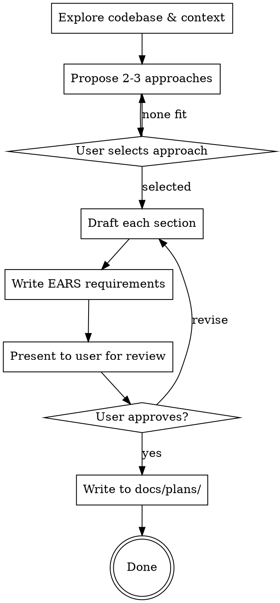

# Writing Design Docs

Produce a structured design document that captures what you're building, why, and how you'll verify it works. Output: `docs/plans/YYYY-MM-DD-<topic>-design.md`. This skill produces the artifact and stops.

## Process

### Proposing Approaches

Before drafting, explore the solution space. Research the codebase and relevant libraries, then propose 2-3 approaches:

- **Lead with your recommendation** and explain why
- For each approach: architecture summary, pros, cons, effort estimate
- Include at least one simpler/smaller and one more robust/extensible option
- Let the user select before committing to a design direction

## Design Doc Template

Six sections. Scale depth to complexity — see Scaling Guide.

### 1. Summary

2-4 sentences. What and why. A busy engineer should understand the project from this alone.

### 2. Project Goals & Non-Goals

**Goals:** Problem being solved. Invariants that must hold. Be specific — "p99 under 200ms", not "fast".

**Non-Goals:** Reasonable things explicitly out of scope. Not negated goals — things you're choosing not to address.

### 3. Context

- **Catalysts**: GitHub Issues, Slack threads, or other triggers
- **Codebase**: Existing folders, files, and design docs relevant to this work
- **External docs**: URLs for third-party library documentation
- **References**: Blog posts, RFCs, or source materials that informed the design
- **Impact area**: Modules or directories that will be modified

### 4. System Design

- **Architecture overview**: How components fit together. Diagram if helpful.
- **New or modified interfaces**: Class/struct definitions, API boundaries. Shape, not implementation.
- **Key functions**: Important functions with expected behavior. Contracts and invariants.
- **Alternatives considered**: Why rejected approaches didn't make the cut.

### 5. Libraries & Utilities Required

**External dependencies:**

| Package | Version | Purpose |
|---------|---------|---------|
| `name` | `^x.y.z` | Why needed |

**Internal modules:**

| Module | Path | Purpose |
|--------|------|---------|
| `name` | `src/path/` | What it provides |

Write "None" if no dependencies — don't omit the section.

### 6. Testing & Validation

**This is the most important section. It should be the most detailed.**

#### Acceptance Criteria

Use EARS format for every criterion. Each must be testable and unambiguous.

#### Edge Cases

Address relevant categories: concurrency/race conditions, dependency failures, error handling/recovery, boundary conditions, security considerations.

#### Verification Commands

Concrete commands to prove correctness. Include linting and formatting checks.

## EARS Quick Reference

| Pattern | Template | Example |
|---------|----------|---------|
| **Ubiquitous** | THE SYSTEM SHALL [behavior] | THE SYSTEM SHALL encrypt all data at rest |
| **Event-driven** | WHEN [event] THE SYSTEM SHALL [behavior] | WHEN a request exceeds the rate limit THE SYSTEM SHALL return HTTP 429 |
| **State-driven** | WHILE [state] THE SYSTEM SHALL [behavior] | WHILE the circuit breaker is open THE SYSTEM SHALL return cached responses |
| **Optional** | WHERE [feature] THE SYSTEM SHALL [behavior] | WHERE verbose logging is enabled THE SYSTEM SHALL log request bodies |
| **Unwanted** | THE SYSTEM SHALL NOT [behavior] | THE SYSTEM SHALL NOT expose internal error details to clients |
| **Complex** | WHEN [a] AND [b] THE SYSTEM SHALL [behavior] | WHEN the queue is full AND the message is high-priority THE SYSTEM SHALL evict the oldest low-priority message |

**Rules:** Use SHALL, never "should"/"may". Each requirement independently testable. No vague terms — use measurable criteria.

## Scaling Guide

| Section | Small (~150w) | Medium (~400w) | Large (~800w) |
|---------|--------------|----------------|---------------|
| Summary | 2 sentences | 3 sentences | 4 sentences |
| Goals/Non-Goals | 2-3 bullets each | 4-5 bullets each | 6+ with invariants |
| Context | Links only | Links + file list | Links + files + impact |
| System Design | 1 paragraph | Interfaces + functions | Diagram + full API surface |
| Libraries | Table or "None" | Table + rationale | Table + alternatives |
| Testing | 3-5 EARS | 8-12 EARS + edge cases | 15+ EARS + comprehensive edges |

## Common Mistakes

| Mistake | Fix |
|---------|-----|
| Testing as afterthought | Use red/green TDD with test cases defined in the spec |
| Vague goals | Add numbers: "reduce p99 from 800ms to 200ms" |
| Missing non-goals | Unstated scope = assumed in scope |
| Implementation as design | Contracts and behavior, not code |
| No context links | Link the catalyst — future readers need the WHY |

## Examples

See `examples/` for graduated examples:
- `small-cli-flag.md` — Adding a `--verbose` flag (minimal but complete)
- `medium-api-endpoint.md` — REST API with auth and rate limiting
- `large-event-system.md` — Distributed event pipeline with retry and DLQ
