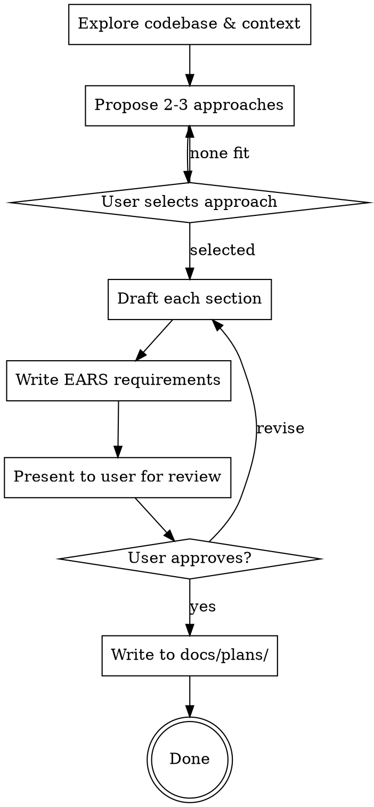

# Writing Design Docs

Produce a structured design document that captures what you're building, why, and how you'll verify it works. Output: `docs/plans/YYYY-MM-DD-<topic>-design.md`. This skill produces the artifact and stops.

## Process



### Proposing Approaches

Before drafting, explore the solution space. Research the codebase and relevant libraries, then propose 2-3 approaches:

- **Lead with your recommendation** and explain why
- For each approach: architecture summary, pros, cons, effort estimate
- Include at least one simpler/smaller and one more robust/extensible option
- Let the user select before committing to a design direction

## Design Doc Template

Six sections. Scale depth to complexity — see Scaling Guide.

### 1. Summary

2-4 sentences. What and why. A busy engineer should understand the project from this alone.

### 2. Project Goals & Non-Goals

**Goals:** Problem being solved. Invariants that must hold. Be specific — "p99 under 200ms", not "fast".

**Non-Goals:** Reasonable things explicitly out of scope. Not negated goals — things you're choosing not to address.

### 3. Context

- **Catalysts**: GitHub Issues, Slack threads, or other triggers
- **Codebase**: Existing folders, files, and design docs relevant to this work
- **External docs**: URLs for third-party library documentation
- **References**: Blog posts, RFCs, or source materials that informed the design
- **Impact area**: Modules or directories that will be modified
- **Existing behavior at risk**: When modifying existing functionality, list behaviors in the impact area that must continue working unchanged. If unclear what existing behaviors matter, ask the developer.
- **Brownfield gap analysis** *(include when the target repo has existing code in the impact area)*: Enumerate existing modules, interfaces, and tests that the change must interoperate with. For each module:
  - File path and current responsibility
  - Public interfaces (exports, API surface) the new code must conform to or extend
  - Existing tests that cover the module (these become verification anchors in Regression Protection)
  
  This analysis feeds directly into the Regression Protection subsection and the Codebase Context blocks in the task list.

### 4. System Design

- **Architecture overview**: How components fit together. Diagram if helpful.
- **New or modified interfaces**: Class/struct definitions, API boundaries. Shape, not implementation.
- **Key functions**: Important functions with expected behavior. Contracts and invariants.
- **Alternatives considered**: Why rejected approaches didn't make the cut.

### 5. Libraries & Utilities Required

**External dependencies:**

| Package | Version | Purpose |
|---------|---------|---------|
| `name` | `^x.y.z` | Why needed |

**Internal modules:**

| Module | Path | Purpose |
|--------|------|---------|
| `name` | `src/path/` | What it provides |

Write "None" if no dependencies — don't omit the section.

### 6. Testing & Validation

**This is the most important section. It should be the most detailed.**

#### Acceptance Criteria

Use EARS format for every criterion. Each must be testable and unambiguous.

#### Regression Protection

*Include this subsection when the spec modifies existing functionality. Omit for greenfield features.*

When modifying existing behavior, identify requirements that must NOT change:

- **Preserved behaviors:** EARS requirements for existing functionality that must continue working. Write these as THE SYSTEM SHALL CONTINUE TO requirements.
- **Verification anchors:** Existing tests that already cover these behaviors (cite file paths). These tests must remain green throughout implementation.
- **Coverage gaps:** If existing behavior has no test coverage, add requirements to write regression tests BEFORE making changes. These become the first tasks in the implementation plan.

If you are uncertain which existing behaviors must be preserved, ask the developer before proceeding.

#### Edge Cases

Address relevant categories: concurrency/race conditions, dependency failures, error handling/recovery, boundary conditions, security considerations.

#### Verification Commands

Concrete commands to prove correctness. Include linting and formatting checks.

## EARS Quick Reference

| Pattern | Template | Example |
|---------|----------|---------|
| **Ubiquitous** | THE SYSTEM SHALL [behavior] | THE SYSTEM SHALL encrypt all data at rest |
| **Event-driven** | WHEN [event] THE SYSTEM SHALL [behavior] | WHEN a request exceeds the rate limit THE SYSTEM SHALL return HTTP 429 |
| **State-driven** | WHILE [state] THE SYSTEM SHALL [behavior] | WHILE the circuit breaker is open THE SYSTEM SHALL return cached responses |
| **Optional** | WHERE [feature] THE SYSTEM SHALL [behavior] | WHERE verbose logging is enabled THE SYSTEM SHALL log request bodies |
| **Unwanted** | THE SYSTEM SHALL NOT [behavior] | THE SYSTEM SHALL NOT expose internal error details to clients |
| **Complex** | WHEN [a] AND [b] THE SYSTEM SHALL [behavior] | WHEN the queue is full AND the message is high-priority THE SYSTEM SHALL evict the oldest low-priority message |
| **Preserved** | THE SYSTEM SHALL CONTINUE TO [behavior] | THE SYSTEM SHALL CONTINUE TO return HTTP 200 for valid API keys after the rate limiter is added |

**Rules:** Use SHALL, never "should"/"may". Each requirement independently testable. No vague terms — use measurable criteria. Use SHALL CONTINUE TO for regression requirements on modified functionality.

## Clarification Markers

During drafting, identify up to 3 unknowns where you made an assumption. Mark them inline in the spec:

```
[NEEDS CLARIFICATION: <specific question> — assumed: <your best guess>]
```

Each marker records both the question AND the assumption the spec proceeds with.

**Interactive mode (user present):** Present markers one at a time, each with a recommended answer. The user can accept the recommendation, provide their own answer, or defer. Integrate each accepted answer immediately into the spec — don't batch them. Remove all markers from the final written spec after resolution.

**Autonomous mode (coder-task):** Post clarification questions as a GitHub issue comment so the issue author can respond asynchronously. Proceed immediately with decomposition and execution using the assumed answers — do NOT wait for responses. If the user later responds on the issue, coder-task's "Receiving Comments" mechanism handles updating the spec and re-running affected steps.

**Rules:**
- Maximum 3 markers per spec. If you have more than 3 unknowns, the scope is too ambiguous — ask the user to clarify before drafting.
- Each marker must be a specific, answerable question — not "needs more thought."
- Each marker must include the assumed answer.

## Scaling Guide

| Section | Small (~150w) | Medium (~400w) | Large (~800w) |
|---------|--------------|----------------|---------------|
| Summary | 2 sentences | 3 sentences | 4 sentences |
| Goals/Non-Goals | 2-3 bullets each | 4-5 bullets each | 6+ with invariants |
| Context | Links only | Links + file list | Links + files + impact |
| System Design | 1 paragraph | Interfaces + functions | Diagram + full API surface |
| Libraries | Table or "None" | Table + rationale | Table + alternatives |
| Testing | 3-5 EARS | 8-12 EARS + edge cases | 15+ EARS + comprehensive edges |

## Common Mistakes

| Mistake | Fix |
|---------|-----|
| Testing as afterthought | Use red/green TDD with test cases defined in the spec |
| Vague goals | Add numbers: "reduce p99 from 800ms to 200ms" |
| Missing non-goals | Unstated scope = assumed in scope |
| Implementation as design | Contracts and behavior, not code |
| No context links | Link the catalyst — future readers need the WHY |
| Modifying code with no regression plan | List preserved behaviors, cite existing tests, or require new regression tests first |
| Modifying brownfield code without gap analysis | Enumerate existing modules, interfaces, and tests in the impact area before designing |

## Examples

See `examples/` for graduated examples:
- `small-cli-flag.md` — Adding a `--verbose` flag (minimal but complete)
- `medium-api-endpoint.md` — REST API with auth and rate limiting
- `large-event-system.md` — Distributed event pipeline with retry and DLQ
- `bugfix-small-regression.md` — Bugfix spec with 3-section format and CONTINUE TO requirements
- `brownfield-delta-change.md` — Brownfield change with gap analysis and delta requirements
